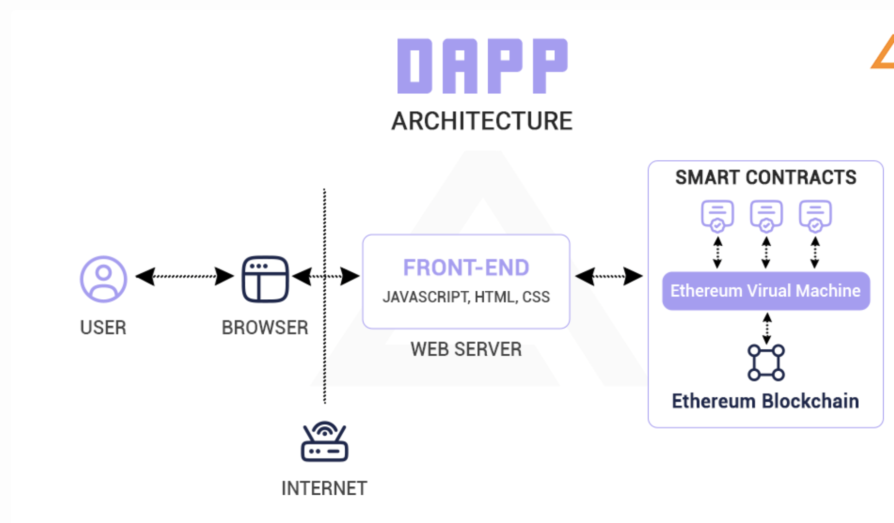

# 合约是什么？
在我们的日常生活中，合约就是合同，上面有一些冗长条款和条件协议或无聊的法律文件。比如房屋租赁合同，保险合同等。

# 智能合约是什么？
**智能合约是存储在区块链上的计算机程序，让我们能够将传统合约转换成数字化合约。** 智能合约完全符合逻辑 — 遵循 IFTTT （if this then that）逻辑结构。 这意味着它们完全按照程序设定执行并且不能更改。智能合约概念于1994年由一名身兼计算机科学家及密码学专家的学者尼克·萨博首次提出。至于区块链我们可以把他们理解为各种公链以及最近火热的L2。比如比特币，以太坊等。

# 智能合约与DApp的关系
如下图所示，智能合约只是整个DApp架构的一部分。我们习惯于将有用户操作界面，可以和区块链交互的网页或者应用称为DApp。而处理在区块链上处理业务的代码称为智能合约。

# 使用智能合约的好处

- 自动执行
- 可预测的结果
- 公开的记录
- 隐私保护
- 可查看的条款

# 使用智能合约的缺点
因为智能合约是用计算机程序编写的，所以难免会出现BUG。在区块链历史上，因为智能合约BUG导致人们资产损失的例子屡屡可见。比如2018年4月22日， BeautyChain智能合约出现重大漏洞，黑客通过此漏洞无限生成代币，导致 BitEclipse (BEC)的价值接近归零。同月25日，SmartMesh出现疑似重大安全漏洞，宣布暂停所有SMT交易和转账直至另行通知，导致损失约1.4亿美金。
