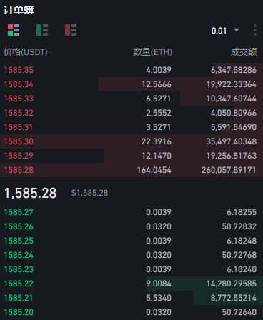
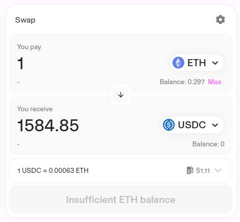

# DeFi 常见金融业务

## DeFi 常见业务形态
前文提到金融服务，最底层的需求就是**交易**和**借贷**，DeFi 的雏形在更早以前就已经诞生，但直到 2021 年年终开始爆发，就是因为**交易**和**借贷**这两项业务终于出现了成熟形态。
### 去中心化交易所与 Swap
传统交易的场所在中心化交易所中发生，类似的，DeFi 的交易则在去中心化交易所（DEX ：Decentralized Exchange）发生。早期人们开发去中心化交易所的思路还是模仿中心化交易所的订单簿模式，但这样撮合的计算资源需求极高，且每次挂单撤单都需要消耗 Gas 成本，导致交易体验极差。

#### Swap

直到以 UniSwap v2 为代表的 Swap 交易的出现，解决了链上交易撮合的问题，带来革命性的进步。Swap 的体验非常简单，最基础的功能只需要用户输入愿意支付的代币和数量，以及想要兑换的代币，就会自动询价，完成交易。

最经典的 Swap 利用 k = x * y 函数作为定价依据，交易的前后 k 值不变。

例如，池子中有 10 个 ETH 和 10000 个 USDC 代币，此时 k 值为 10 * 10000 = 100000。当某人向 Swap 出售 1 个 ETH 时，为了保持 k 值不变，池子中的 USDC 数量将变为 100000 / 11 = 9090.9，他将得到 909.1 个USDC。这个定价曲线写成智能合约后需要的资源极少，并且很好地体现了东西越少越昂贵的定价逻辑，让交易可以随时进行。流动性提供者需要提供两种代币作为做市的流动资金，他们可以获得交易手续费抽成作为盈利，整个经济模型的雏形就出现了。

交易采用了自动做市商的机制（AMM：Automated Market Maker），用巧妙的方法模拟了传统交易市场的两种角色：

- 交易者：客户一般通过订单簿进行撮合交易。
- 专业做市商：在证券市场上，由具备一定实力和信誉的独立证券经营法人作为特许交易商，同时向买卖双方进行报价。做市商有义务在普通交易者挂单时，主动与其成交为市场提供流动性，通过买卖订单的差价赚取利润。

Swap 的角色与其类似，但有细微的差别：

- 交易者：一般只能按当前交易对的实时价格即时成交。
- 流动性提供者：代替专业做市商为市场提供流动性的功能，任何人都可以为交易对提供两种代币成为流动性提供者，并获取代币证明他在整个流动性池里所占的份额。流动性池将随时与任何愿意交易的用户进行交易，不通过买卖差价获利，而是通过规定的交易手续费（如 0.3%）获利。

#### Swap 的演化
UniSwap v2 的智能合约代码简单可靠，被整个行业学习借鉴最多次，但也存在无常损失、滑点、资本效率过低等问题。在它的基础上去中心化交易所还进行了很多改进，：如定制特殊的交易曲线服务于稳定币之间的交易，带来更低滑点；允许资金集中在某一区间做市，将更多资金集中在市价附近以增加资本利率效率；链下撮合，批量成交的方式实现限价单，保护用户隐私；像微积分一样将定价曲线分割为标准区间，方便流动性质押者选择，实现链上限价单等等……

各种基于标准模型改进的 Swap 为不同交易场景的需求做出了优化，使得链上交易的流动性和体验越来越好，而后还发展出“聚合交易所”，帮助用户在各个大型 DEX 之中找到更好的价格。

### 借贷协议

#### 借贷协议基本业务逻辑

链上借贷协议（Lending Protocol）提供类似于传统银行的服务，可以存款生息，也可以支付利息向协议借款，与传统银行类似，借贷协议最基础的盈利模式也是赚取存款借款之间的利息差。

不同的是传统银行有很多信用贷款的业务，而链上借贷通常采用“超额抵押”的方式确保资产安全的，也就是在贷出资金之前，贷款人需要先抵押一定资产，然后借出小于抵押品价值的资金。

此外，借贷协议的利率往往是随行就市的动态利率：当没人借款资金利率用率低时，存贷的利率也会较低；反之说明当前市场对某种代币需求火热，该种代币的存贷利率都会提高。

#### 超额抵押与清算

链上借贷是通过“超额抵押”的方式确保资产安全的，也就是在贷出资金之前，贷款人需要先抵押一定资产，如果抵押的资产价值高于其贷款，那就可以保障借款人的资金安全。

- 比如客户存入了 10000$ 的 USDC 作为抵押物，协议规定的**抵押率**假设是 90%，意味着这些 USDC 能为 9000$ 的债务提供安全担保，那如果协议借出低于安全值的金额，存款者都有充分信心贷款人不会赖账。

但如果我们的抵押资产（或贷出的资产）本身有较大波动性，就很可能出现资不抵债的风险，非常容易触发“清算”机制。

- 比如客户存入了价值 10000$ 的 BTC 作为抵押物，对于波动资产，借贷协议往往会设定更保守的抵押率，如 80%，意味着这些 BTC 能为 8000$ 的债务提供安全担保，那如果我们借出7000$ 的 USDC ，在目前来说也是安全的。

然而随着币价的波动，事情会发生变化，假设市场发生了较大利空事件，BTC 币价短时间内下跌了 25%，原本价值 10000$ 的 BTC 下跌成了 7500$ ，这时候还未出现资不抵债的情况，但可安全担保的金额已经降低为 7500 * 80% = 6000$ ，这时候第三方的“清算者”就会介入。

- 清算者替贷款人还清 7000$ 的债务，**借款人**的资金得到了保护；然后**清算者**以折扣价获得了价值 7500$ 的 BTC ，他如果立即在市场上跑抛售就能获得 500$ 的差价作为利润；最后是**贷款人**，他承担了损失，但也不必再还之前的债务。

清算机制保证了整个借贷系统的安全，很难出现坏账。即便在黑天鹅事件发生，币价闪崩的行情之下，有可能出现抵押物币价下跌过快，导致清算者无利可图，系统才可能出现坏账，这种罕见的情况发生时，借贷系统也可以选择以治理代币来消解坏账，让协议在极端行情之后重新恢复正常。

&nbsp;

目前 Swap 和借贷协议覆盖了最基础的金融需求，已经成为各条公链的标配，每条公链都会产生自己的头部 Swap 和头部借贷协议。在它们的基础上，往往还会被赋予代币激励，与其它项目嵌套，DeFi 的可组合性为更多创新提供了丰富的可能。

## 引用及注释

[1] RPC（Remote Procedure Call）即远程过程调用协议，是一种通过网络从远程计算机上请求服务，而不需要了解底层网络技术的协议。如 Metamask 钱包就使用了公共的 RPC 节点，它们可能是由如 Infura 之类的大型基础设施服务供应商提供的，这些供应商可能收集访问者的 IP 地址等信息。