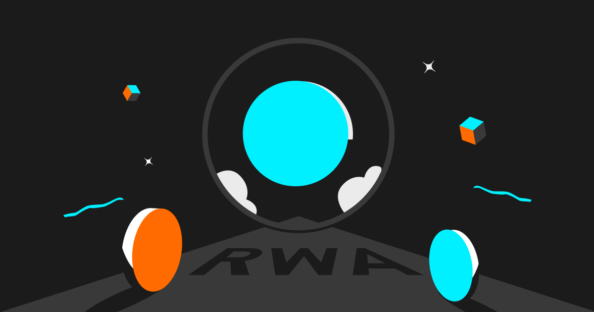

RWA（Real World Assets）正在成为加密世界一个备受关注的话题。作为DeFi的衍生品，RWA的出现增强了加密货币和现实世界之间建立联系，它利用区块链技术将现实世界的资产映射到加密世界，从而使得这些资产具备更好的流动性，并利于DeFi的可组合性，从而衍生出更多、更复杂的金融资产。

# RWA是什么
RWA（Real World Assets），即真实世界的资产，是指那些有实际价值的资产通过区块链技术进行代币化，拥有代币就代表你在现实世界里有这个资产的所有权，你可以在链上进行借贷、出租、买卖等交易。而作为其价值支撑的底层资产通常是房地产、股票、债券等。事实上，加密行业早有RWA的成功案例，我们常用的稳定币USDT、USDC等就属于RWA。

# RWA运作原理
RWA的运作原理是将实际的资产（如不动产、股票、债券等）通过区块链技术进行数字化管理和交易。这些实际资产会被转换成代币或其他数字资产，然后通过智能合约在区块链上进行交易和转移。这样一来，RWA可以提供更高的流动性和更低的交易成本，同时也可以增加投资者的信心和透明度。此外，RWA的运作还需要依靠一些中介机构（如资产管理公司、托管机构等）来进行资产评估、代币发行、交易撮合等工作。

# RWA的优势和潜力
首先，RWA可以为加密货币市场带来更多的实际资产支持，从而增加投资者的信心和市场价值。其次，RWA可以为传统金融市场带来更高的流动性和更低的交易成本，同时也可以提供更多的投资机会。尤其对DeFi而言，RWA的数字化可以为DeFi提供更多的资产类型，并扩大DeFi的市场规模。此外，RWA还可以通过数字化管理和交易来提高资产的透明度和安全性，减少欺诈和风险。随着区块链技术的不断发展和应用，RWA的潜力还将不断扩大。

# RWA生态概览

## Maker DAO
官网： https://makerdao.com/

Maker DAO 项目成立于2014年，是以太坊上最早的去中心化自治组织之一。Maker DAO 可以理解为是基于以太坊区块链的去中心化金融系统，它提供了一种稳定币 Dai（锚定美元的加密货币），一种治理代币 MKR，以及一种抵押贷款平台 Maker Vault。

* 2022 年 11 月，Maker DAO 完成了对 RWA（Real World Assets）的支持，允许用户抵押房地产、汽车、艺术品等实物资产来生成 Dai，增加了 Dai 的抵押物种类和价值。

