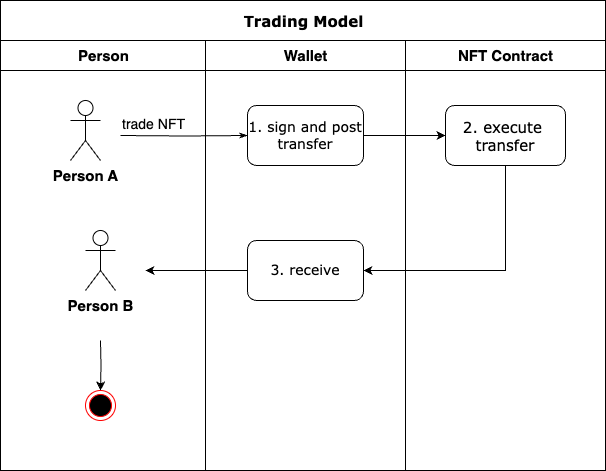
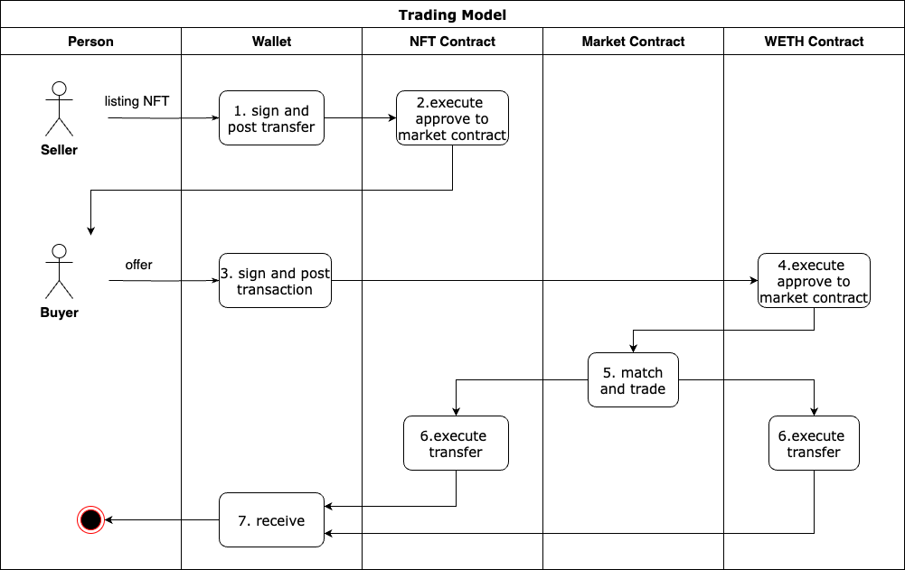

# NFT 市场
NFT 市场，也就是交易平台。它涉及到数字资产流通，了解它的运行规则是非常重要的。 
在 NFT 被铸造出来以后，交易平台是重要的二级流通场所，类似股票交易所，当然有点不太一样的是 NFT 交易平台核心都是去中心化的，依靠多个智能合约协作来完成交易。新手一般会比较早的接触 NFT 交易平台，它给玩家带来了最直接的 Web3 参与体验。
- NFT 的交易本质是 ERC-721 标准中的 transfer 行为。
- 不同交易平台会有一些特点，比如 OpenSea 是全球最大的交易平台、Binance 背靠交易所、LooksRare 由社区驱动、Rarible 支持传统金融交易等。
- 不同交易平台的手续费、版税政策是不一样的。

## 通用功能
### 分类
### 系列
### 购买
### 售卖
- 手续费：交易平台对 NFT 二级销售收取的费用（2.5%），由卖方承担。
- 版税：royalties，NFT 在买卖和转让中，原始创作者或版权持有人获得的一部分收益。
> 通过智能合约来实现（[ERC-2981](https://eips.ethereum.org/EIPS/eip-2981)）。挂单在平台，使用平台版税功能来实现。
### 拍卖（auction）
NFT 的拍卖方式基本上都是荷兰式拍卖，也称为降价拍卖。随着时间线性降价，直至有人交易完成。在交易平台挂单时，可以选择直接售卖或拍卖的方式。
 
另外一种拍卖方式就是英式拍卖，也是传统领域的拍卖方式，价高者得。

## 特殊玩法
### 盲盒
NFT 的盲盒玩法与现实生活中的盲盒玩法是比较相似的，用户购买的是一个未知的商品，拆开后得到确定。

## 交易模型
你看明白了 NFT 的交易模型，就可以理解交易的本质，也是有助于增加安全意识的。
- 模型一：用户 A 通过钱包，直接交易 NFT 给用户 B。

- 模型二：用户 A 将 NFT 挂在交易平台售卖，用户 B 购买。

