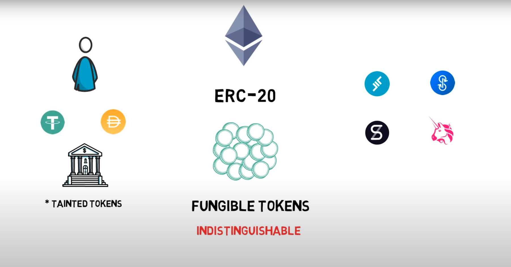
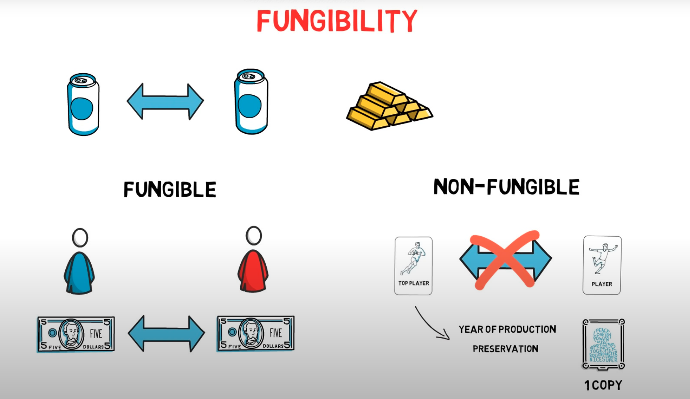
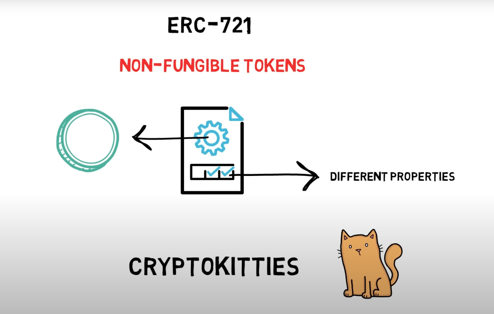
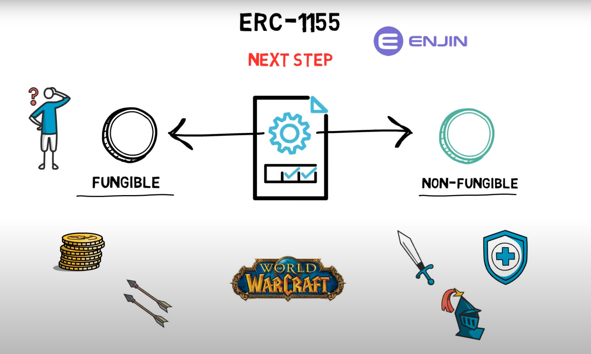
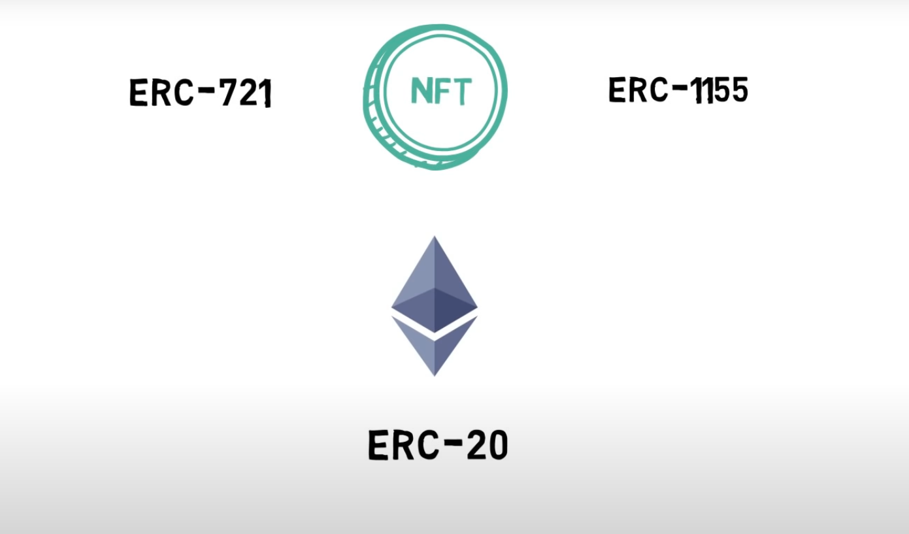

# NFT 演变过程
在了解到 NFT 的基础知识后，熟悉它的演变过程可以帮助你理解更加深刻，这涉及到一些以太坊基础知识，分别是：EIP、ERC-20、ERC-721、ERC-1155。
> 从市场视角，NFT 的产生可以追溯到 CryptoPunks 和 CryptoKitties，因为篇幅有限，这里不介绍市场演变过程，只介绍基础知识。

## EIP
[EIP](chapter2/blockchain.md) (Ethereum Improvement Proposals) 全称以太坊改进提案，描述了以太坊平台的标准，包括核心协议规范、客户端 API 和合约标准。Web3 生态有几个非常重要的代币标准就是出自于这些提案，比如 ERC-20、ERC-721，前者带动了 Defi 领域的兴起，后者带动了 NFT 领域的兴起。

## ERC-20
[ERC-20](https://eips.ethereum.org/EIPS/eip-20) 表示代币标准，也被称为同质化代币标准。
- 该标准是以太坊生态最早的代币标准，由 Vitalik 参与制定。
- 提案动机：标准接口允许以太坊上的任何代币被其他应用程序重复使用：从钱包到去中心化交易所。
- 现在市面上流通非常广的稳定币，比如 USDT、USDC 等，就是采用了 ERC-20 标准。

## ERC-721
[ERC-721](https://eips.ethereum.org/EIPS/eip-721) 表示非同质化（也可翻译为不可替代）代币标准
- 该标准是受到了 ERC-20 的启发，并建立在 ERC-20 2年的应用经验之上。
- 提案动机：允许钱包/经纪人/拍卖应用程序与以太坊上的任何 NFT 配合使用。
- 同质化和非同质化的区别如下图。

- 现在币面上绝大部分 NFT 采用的就是 ERC-721 标准。

## ERC-1155
[ERC-1155](https://eips.ethereum.org/EIPS/eip-1155) 表示多代币标准。
- 该标准是建立在 ERC-20 和 ERC-721 基础上。
- 提案动机：ERC-20 和 ERC-721 过于单一，不能满足新兴的行业需求，比如区块链游戏，采用 ERC-1155 标准的合约可以同时操作多种代币，节约交易成本。
- 少部分 NFT 既有同质化，也有非同质化需求，采用的是 ERC-1155 标准，在游戏领域采用较多。

## 演变过程
1. 最早是以太坊的建设者们希望促进生态更好的发展，于是有了 EIP。
2. 在 EIP 的应用层，Vitalik 等人设计了第一个代币标准，也就是同质化代币 ERC-20。
3. 在 ERC-20 发展了 2 年多的时候，William Entriken 等人在这基础上，为非同质化代币设计一个标准 ERC-721。
4. 在 ERC-721 提出半年左右时，ERC-1155 被提出，合并了 ERC-20 和 ERC-721 的特性。

## 总结
NFT 实际上是非同质化代币的统称，随着以太坊生态发展逐渐被标准化，代码化，到最后应用程序实现。随着生态逐渐繁荣，更多的需求被挖掘出来并标准化，比如代币标准（ERC-777）、半同质化代币（ERC-3525）等等。（延伸阅读？）

