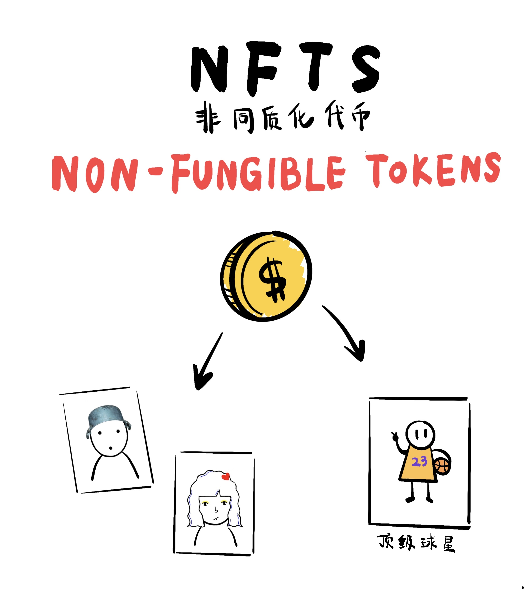
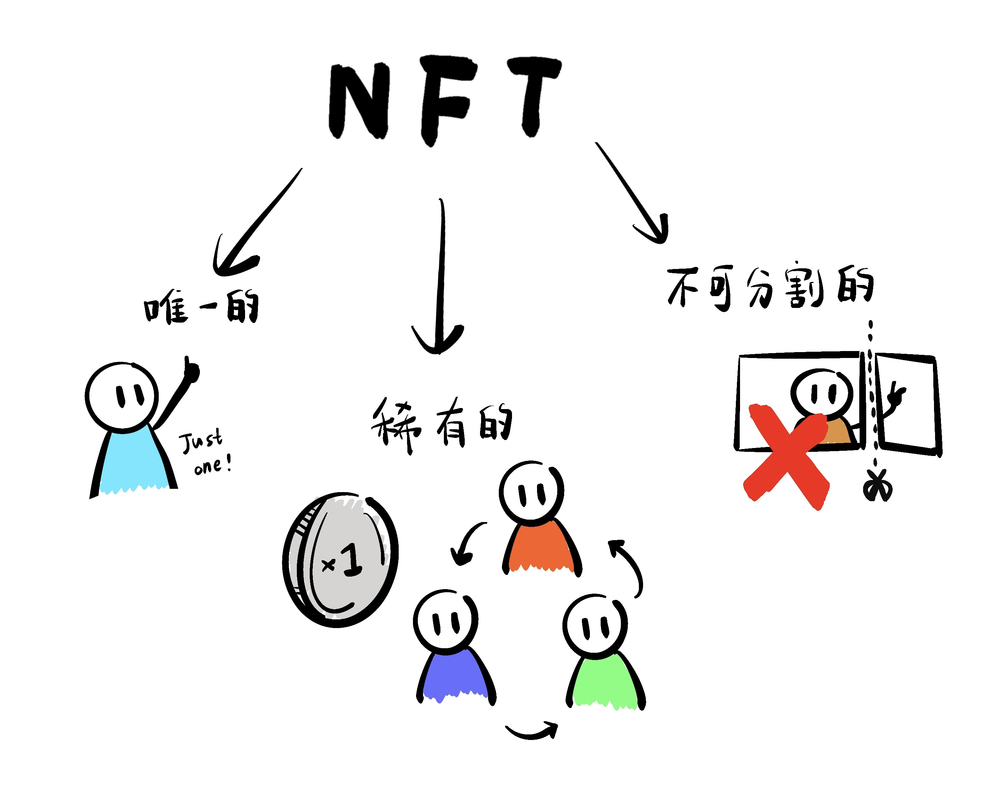

# 什么是NFT

NFT（Non-fungible token）是代表一种类型的数字代币或资产，起源于以太坊区块链。

## NFT 的特征
想要理解透彻 NFT 的特征，我们需要了解一些基础技术相关知识，比如 EIP、ERC-721、钱包、智能合约等。

### 独特的（unique）
表示是独一无二，因为智能合约的不可篡改特性，按照 ERC-721 标准，它所产生的每一段数据也是唯一的。

### 可证明稀缺（provably scarce）
基于区块链的特性，在链上的每一笔交易，都会被区块记录下来。所以由智能合约产生的 NFT，每一次 mint、approve、transfer 等链上写数据行为，也都会被记录下来的，所有人都可以在区块链浏览器（比如 etherscan）上追溯 NFT 历史行为。

### 不可分割的（indivisible）
跟 ERC-20 不一样，ERC-721 是没有 decimals 接口方法的。所以基于 ERC-721 标准所产生的 每个NFT，数量就是整数1，没有小数点，从数据层面无法被分割。

## NFT 的本质
我们深入到技术层面看，NFT 的本质只是一个地址（wallet）拥有一段数据（data），如何理解：
- NFT 产生于智能合约(链接介绍?)。
- NFT 被铸造出来时，在智能合约里会用一段数据来永久存储令牌id（tokenId）和持有账户(EOA或合约)地址（address）。
- 当发生交易时，本质是标记 NFT 的令牌id 的持有账户地址发生了变化（从 A 到 B）。

所有我们在市场上看到的一些 NFT 具有各式各样的视觉效果和文本展示，这些只是它的外在表现形式，由市场（比如 OpenSea）定义，它并不是 NFT 标准，在<NFT 创造过程>章节我们将讲解 NFT 从技术和外在表现是怎么结合的。

### 为什么要从技术上理解？
如果你想成为 NFT 的相关从业者，了解区块链和智能合约运行的基本规则是非常重要的，可以帮助你更好的理解 NFT，也可以让你加深对 Web3 安全机制的理解。

## NFT 的外在表现
在了解到 NFT 的本质后，那它的外在表现是怎样的呢？通过 NFT 交易平台（比如 OpenSea），我们可以了解到一些主流的 NFT 玩法，大致分为以下几类：艺术、游戏、会员、头像、摄影、音乐等。
- 每个 NFT 项目表示一个集合（collection），背后关联的就是一个已布署在链上的智能合约。
- 每个属于项目的 NFT 都有单独的外在信息展示，形式有静态图片、动图、视频等，另外还有名称、描述、详细、特质等文本内容。
- NFT 外在形式差异，决定了稀有度，在一定程度上体现了它在整个项目中的价值。
