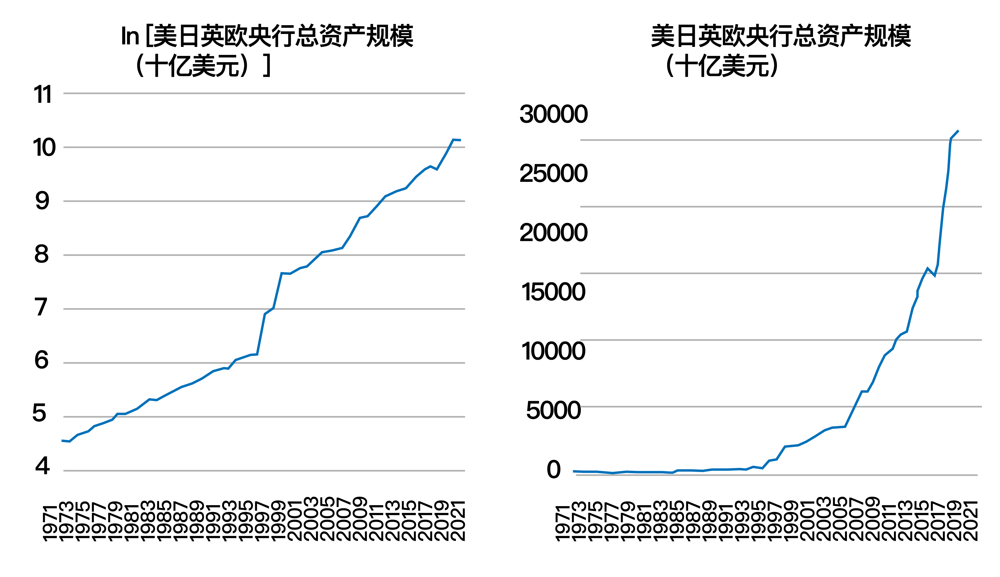

# 反洗钱与加密货币

Web3 拥有无许可全球化的去中心化精神，与现在以中心化实体搭建的传统金融确实存在一定摩擦。现实活动中矛盾最冲突最直接的部分，就是与反洗钱（AML）相关的部分。

但这并不是去中心化与中心化的本质矛盾，Web3 的愿景是用代码即法律的精神减少中心化实体作恶的可能，用智能合约的自动执行减少传统金融系统低效的部分。大多数 DeFi 的参与者也并不希望 DeFi 成为非法活动的工具，发生黑客事件造成了经济损失时，人们还是希望被盗资金能被追回。

## 无许可的去中心化精神与非法资金的矛盾

回顾 Web3 的源头，也就是区块链技术和比特币的诞生，那是中本聪在 2008 年次贷危机中，被美国政府无限 QE 救市所释放的天量资金所震惊。银行家冒险获得了收益，危机爆发由纳税人兜底，而普通民众对此毫无反抗能力，因此萌生了创造一种能脱离中心化权威的货币的渴望。

从布雷顿森林体系之后，各国央行指数膨胀的资产负债表 [1] 来看，以及过往人类历史上滥发纸币、降低金属货币成色收取铸币税的事件，可以说任何人类政府都难以遏制滥发货币的冲动，这也是去中心化精神希望反抗的。存在加密货币的竞争，任何如津巴布韦政府所做的行为都可能使得国民转向加密货币，这对法币体系来说也产生了使其更珍惜自身信用的压力。

比特币也曾经被犯罪活动所利用，在丝绸之路 [2] 网站上，贩毒等地下活动曾看中比特币的匿名性将其采用为非法交易的媒介。但这种匿名性仅存在于钱包地址与现实身份的匿名，源于执法机构对刚出现的比特币的不熟悉而存在。后续出现了专门为比特币地址做标签的大数据公司，当监管机构学会查看比特币现金流之后，区块链公开透明的特点开始被人们认知，地下活动开始转向门罗币等其他更注重隐私的加密货币之上，比特币和区块链也渐渐开始被更主流的市场关注。

由此可以看出，区块链技术有工具中性的特点，加密货币资产也只是众多资产的一种。如现金、实物黄金可能被用于非法洗钱活动之中，加密货币同样可能被犯罪分子选做洗钱的工具。这是无许可的去中心化精神与非法资金之前的矛盾，整个 Web3 行业需要思考如何妥善解决这种矛盾。

## DeFi 与非法资金可能存在风险的环节

目前资金在 DeFi 领域之内流动仍享有最大程度的自由，但在加密货币与法币的交换环节，可能出现与非法资金的交集。

### 中心化交易所的充值与提现

大量中心化交易所会主动配合监管部门的政策，若用户与被制裁的链上地址有过互动，可能导致风控。如上文提到的与 TornadoCash 交互过的地址，充值到中心化交易所可能导致账户被冻结。

### OTC（场外交易）

OTC 交易是指离开交易所等公开市场，用户与用户之间私下协商的交易。可能涉及第三方担保人，由 A 向 B 进行银行汇款转账法币，由 B 向 A 转账加密货币完成的点对点交易。在这个交易过程，法币的收款方有可能收到不法资金到账银行账户被冻结（少数情况下也可能出现加密货币为非法资金导致冻结）。在全球各地的 OTC 交易中，不论交易标的是否为加密货币，都可能触发 AML 机制导致银行账户被冻结，OTC 交易时应当谨慎确认交易对手的资金来源。

## 引用及注释

[1] 央行资产负债表包含发行货币、商业银行存款、有价证券抵押物等资产及负债，影响着社会中的基础货币供应量。[全球-各国央行资产负债表规模](https://sc.macromicro.me/charts/56133/global-cbs-total-assets)

[2] 丝绸之路是 2011 年在美国兴起的匿名黑市购物网站。[维基百科：丝路](https://zh.wikipedia.org/wiki/%E7%B5%B2%E8%B7%AF_(%E8%B3%BC%E7%89%A9%E7%B6%B2%E7%AB%99))