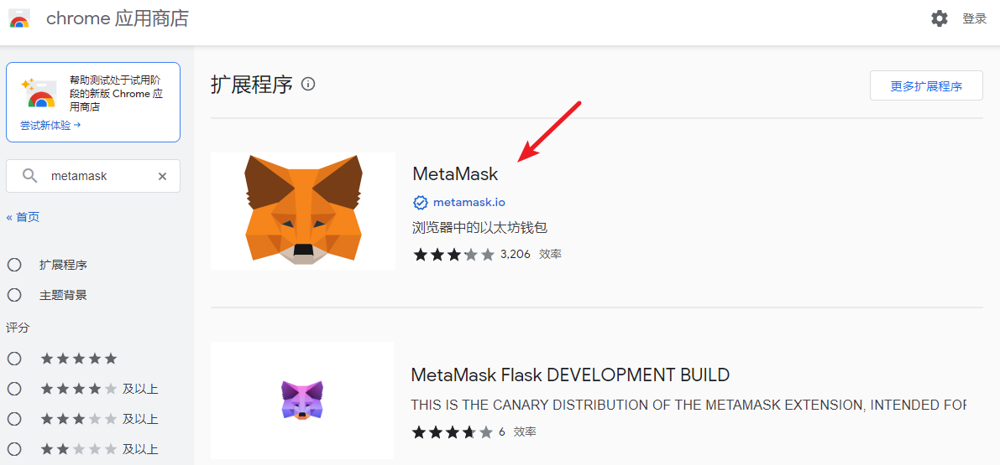
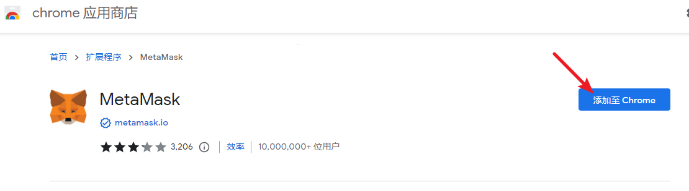
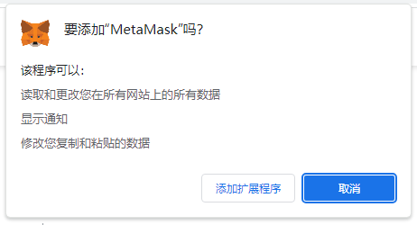

# 创建和使用钱包

## 私钥与钱包地址的关系

回顾一下 Web3 公私钥账户体系的关系，私钥代表了一个钱包地址的所有权，拥有一串私钥就能控制某个钱包地址之下的所有资产。我们通过几个例子了解它们常见的形式：

- 私钥：8e304f6cb302b452f07f961637ec3ed7749a9e497f289348e5e43a3de34b42a4
- 助记词：decorate divert life youth black argue rare define sense boost lazy gaze
- 钱包地址：0x7aA8f8C391F8408C8E9F97755212C18B5017b1b9

私钥不便于人脑记忆，因此也常以 BIP39 标准 [1] 转换成助记词的形式出现，两者是等价的，任何情况下都不应道暴露你的助记词或私钥。将助记词或私钥导入钱包客户端就可以加载自己的钱包地址。

## 钱包客户端

钱包客户端是普通用户与区块链沟通的媒介，常见的有手机端的各种钱包 APP（如 Coinbase Wallet、ImToken 等）；在 PC 端最常用的是各种浏览器插件钱包，其中以 MetaMask 使用量最广，任何与以太坊生态兼容的项目可以用 MetaMask 访问。

下面我们会以 MetaMask 钱包为例带大家操作一次具体流程。

首先，我们需要用 Chrome 浏览器（或其他兼容 Chrome 内核的其他网页浏览器）：
1. 进入 Chrome 应用商店：[https://chrome.google.com/webstore/category/extensions?utm_source=chrome-ntp-icon](https://chrome.google.com/webstore/category/extensions?utm_source=chrome-ntp-icon)

2. 搜索 Metamask，选择 metamask.io 认证的插件:

3. 点击“添加至 Chrome”

4. 点击“添加扩展程序”

- 你也可以直接访问以下链接安装，但最好按上方步骤自行从官方渠道寻找下载源，仅把下方网址作为校对，任何网页提供的直接下载的 MetaMask 都有可能是欺诈性的假地址。**随意下载不明来源的钱包可能导致严重资产损失！**[https://chrome.google.com/webstore/detail/metamask/nkbihfbeogaeaoehlefnkodbefgpgknn?utm_source=chrome-ntp-icon](https://chrome.google.com/webstore/detail/metamask/nkbihfbeogaeaoehlefnkodbefgpgknn?utm_source=chrome-ntp-icon)

## 引用及注释

[1] BIP39 诞生于 2013 年，在后来成为了最受欢迎也最常见的助记词格式，它的助记词是一个由12 至 24 个单词组成的短语，并支持 128 位和 256 位随机数的编码，另外还可新增校验（checksum）和 Passphrase 来保护私钥，单词表是固定的，共包含 2048 个单词。