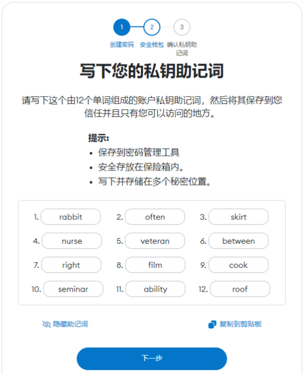
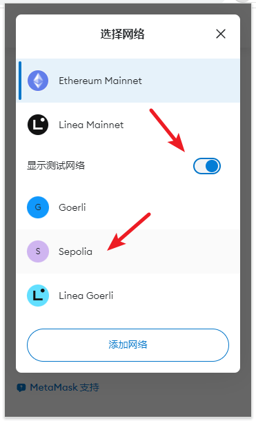

# 创建和使用钱包

## 私钥与钱包地址的关系

回顾一下 Web3 公私钥账户体系的关系，私钥代表了一个钱包地址的所有权，拥有一串私钥就能控制某个钱包地址之下的所有资产。我们通过几个例子了解它们常见的形式：

- 私钥：8e304f6cb302b452f07f961637ec3ed7749a9e497f289348e5e43a3de34b42a4
- 助记词：decorate divert life youth black argue rare define sense boost lazy gaze
- 钱包地址：0x7aA8f8C391F8408C8E9F97755212C18B5017b1b9

私钥不便于人脑记忆，因此也常以 BIP39 标准 [1] 转换成助记词的形式出现，两者是等价的，任何情况下都不应道暴露你的助记词或私钥。将助记词或私钥导入钱包客户端就可以加载自己的钱包地址。

## 钱包客户端

钱包客户端是普通用户与区块链沟通的媒介，常见的有手机端的各种钱包 APP（如 Coinbase Wallet、ImToken 等）；在 PC 端最常用的是各种浏览器插件钱包，其中以 MetaMask 使用量最广，任何与以太坊生态兼容的项目可以用 MetaMask 访问。

下面我们会以 MetaMask 钱包为例带大家操作一次具体流程。

首先，我们需要用 Chrome 浏览器（或其他兼容 Chrome 内核的其他网页浏览器）：
1. 进入 Chrome 应用商店：[https://chrome.google.com/webstore/category/extensions?utm_source=chrome-ntp-icon](https://chrome.google.com/webstore/category/extensions?utm_source=chrome-ntp-icon)

2. 搜索 Metamask，选择 metamask.io 认证的插件:

3. 点击“添加至 Chrome”

4. 点击“添加扩展程序”

- 你也可以直接访问以下链接安装，但最好按上方步骤自行从官方渠道寻找下载源，仅把下方网址作为校对，任何网页提供的直接下载的 MetaMask 都有可能是欺诈性的假地址。**随意下载不明来源的钱包可能导致严重资产损失！**[https://chrome.google.com/webstore/detail/metamask/nkbihfbeogaeaoehlefnkodbefgpgknn?utm_source=chrome-ntp-icon](https://chrome.google.com/webstore/detail/metamask/nkbihfbeogaeaoehlefnkodbefgpgknn?utm_source=chrome-ntp-icon)

## 创建钱包

点击右上角的小狐狸 Logo 按钮，即可开始创建钱包。
    

创建的步骤按照 Metamask 的流程一步一步傻瓜化进行即可，其主要的关键点如下：

1. 输入密码将成为此钱包插件内所有账户的统一密码，并且**不可找回**。

    

2. 出现 12 个英文单词的**助记词**的时候，应当**严肃对待，妥善保存**。

    

[详细操作步骤 点击此处查看](https://metatraining.buidlerdao.xyz/1-1-7028d9c69ea2442ea56ae580320180f9)

## 切换网络

钱包创建完毕，我们默认处于 ETH 主网，而我们实践中可能遇到的 Optimism、Arbitrum、Optimism，以及后续我们测试时使用的 Goerli、Sepolia 等测试网，都是不同的区块链网络，我们都需要切换对应网络才能访问该网络上的资产。

1. 点击左上角按钮进入网络列表
   
    

2. 将显示测试网设置打开，并选择 Sepolia 测试网
   
    

## 添加代币

此时，一般我们的钱包内只会显示 ETH 一种代币，即便你的钱包内存在其他代币也不会显示出来，我们需要导入代币的合约地址 [2]，将其导入，之后你就会看到该代币的余额。

点击添加代币并输入争议的合约地址后，我们就可以在列表里看到对应代币。如输入：0x94a9D9AC8a22534E3FaCa9F4e7F2E2cf85d5E4C8，可加载 Sepolia 测试网上的 USDC 代币。

Sepolia 测试网各代币合约地址：
- USDC：0x94a9D9AC8a22534E3FaCa9F4e7F2E2cf85d5E4C8
- USDT：0xaA8E23Fb1079EA71e0a56F48a2aA51851D8433D0
- WBTC：0x29f2D40B0605204364af54EC677bD022dA425d03

[详细操作步骤 点击此处查看](https://metatraining.buidlerdao.xyz/1-2-7212e781e7874effa144d88dc2a5cbe2)

## 引用及注释

[1] BIP39 诞生于 2013 年，在后来成为了最受欢迎也最常见的助记词格式，它的助记词是一个由12 至 24 个单词组成的短语，并支持 128 位和 256 位随机数的编码，另外还可新增校验（checksum）和 Passphrase 来保护私钥，单词表是固定的，共包含 2048 个单词。

[2] 每个智能合约地址都有它自己的合约地址，这里的代币也是一种符合 ERC20 标准的智能合约，因此每一个代币也都拥有自己独一无二的代币合约地址。例如：[Sepolia 测试网的 USDC 代币](https://sepolia.etherscan.io/token/0x94a9d9ac8a22534e3faca9f4e7f2e2cf85d5e4c8)