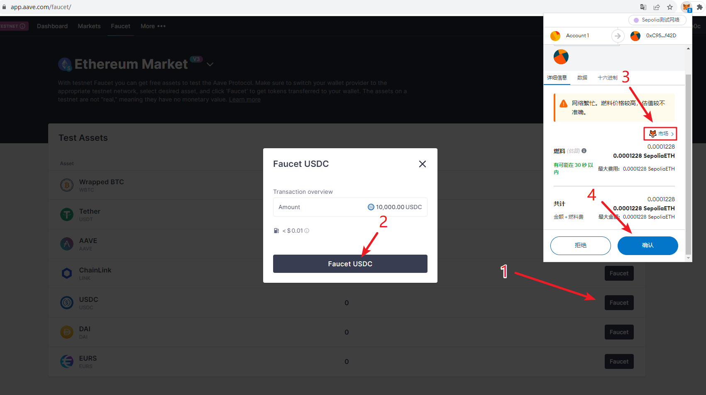

# 领取 Gas 与测试币

拥有钱包之后，我们需要获得一些 Gas 和测试币进行尝试。

## 在公共水龙头获取 Gas

Alchemy 的 SepoliaFaucet 是目前比较好用的水龙头，我们可以在上面低门槛地领取 Sepolia 测试网的 ETH 作为 Gas。

1. 打开 https://sepoliafaucet.com/ ，并登陆。
    

2. 首次需要点击 Signup 注册一个账号(新账号需回答几个问题，可随意勾选，不影响领取 Gas)
    

3. 输入收款地址，通过人机验证，点击 Send Me ETH
    

4. 可以点击下方链接，查看收款记录
    
    

## 领取测试币

1. 打开 https://app.aave.com/，点击 Connect wallet
    
2. 点击 Browser Wallet，并在 Metamask 弹出框点击连接
    
3. 点击 右上角设置按钮，打开 Testnet mode
    
4. 点击 ∨ 按钮，确认处于 Ethereum Sepolia 网络，点击 Faucet 进入测试币领取页面
    
5. 选择需要领取的测试币，并在 Metamask 弹出框中确认（小技巧：弹出框中点击 3 处可以选择 Gas 费的水平，节约交易手续费）
   
   
6. 稍等片刻，你会发现测试币已经到账
   

## 尝试发送代币

小任务：MetaMask 的界面已经相对人性化了，请大家尝试给其它钱包地址转账一定金额。
如：给 0xD548a5e31DE2b4c2681A58a3be5302aBCAe4bC57 发送 0.05 ETH 或者 10 枚 USDC
   

## 在区块浏览器上查看交易记录

转账成功后，在 Metamask 上会留下简单的交易记录，更详细的交易记录则需要在区块浏览器上查看，下面请大家尝试在区块浏览器上查询自己的交易记录，随意探索体会不同交易的区别。

1. 点击 Metamask 右上角的更多按钮，点击“在 Explorer 上查看”
   

2. 或者点击活动，点击特定的交易记录，再点击在区块浏览器上查看
   