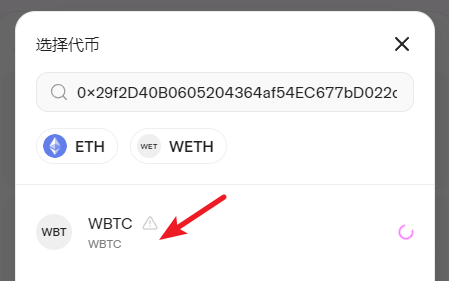
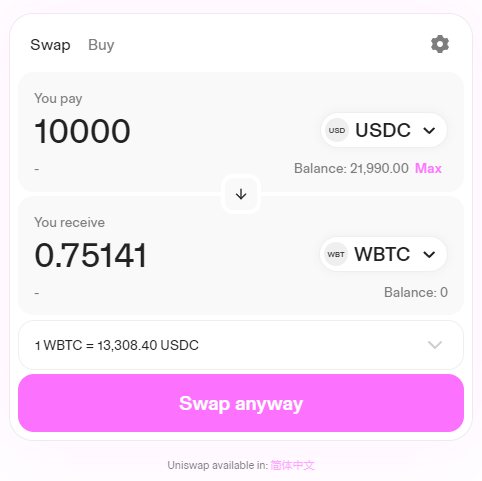

# DeFi 实操

## 借贷协议
我们先来尝试一下 DeFi 当中的借贷协议，其业务逻辑是我们将一些代币作为抵押品（一般是市场接受度好的，暂时不希望卖出变现的优质代币，如 WBTC），借出一定量的其它代币（如稳定币 USDC）。

打开 [app.aave.com](https://app.aave.com/) ，检查一下我们是否处于 Ethereum Sepolia 测试模式。

如果成功，那么左侧会显示我们已经领取的测试币，如 WBTC、USDC 等等，右侧则列出了可借出的资产。

### 存款

1. 点击 WBTC 后面的 Supply ，准备存入 WBTC。输入要存入的数量，如 1 个 WBTC。可以看到首次使用，Approve 的按钮会亮起，表示我们需要授权借贷协议使用我们的 WBTC。

2. 授权 Approve 操作，一般需要发送一笔链上交易的。不过新的 ERC20 代币增加链下签名 Permit 授权的新特性（这种授权操作将不会产生 Gas 费，但一定要注意检查授权的内容）

- Owner：代币所有者，你的钱包地址
- Spender：使用者，这里应为借贷合约的地址
- Value：数量，因为 WBTC 的 Decimal 为 8（精确到小数点后 8 位），因此是 1 后面 8 个 0
- Nouce：（签名的编号，从 0 开始）
- Deadline：十位数字表示的时间戳，此处即 2023-10-25 18:16:06 ，即授权有效期 1 小时

3. 授权成功后，点击 Supply 正式存入 WBTC

4. 存款成功后，左侧列表的上方会显示出你的存款

- Collateral：是否作为抵押品的开关，默认开启
- Supply：存入更多该代币
- Withdraw：取出该代币

### 贷款

在存入了一定存款并开启抵押按钮之后，意味着你可以借出一定数量资金，下面我们开始尝试借出一些 USDC。

1. 查看右侧，我们可以看到在目前的抵押品状况之下，我们最多可借出 41580 枚 USDC，点击 Borrow 开始借贷。

2. 输入一定金额的 USDC，点击 Borrow 即可开始借贷。

- 可以看到我们的健康因子从无穷大变为了 3.75 ，当健康因子低于 1 时你的抵押品将会被部分或全部清算。特别是当你的抵押品和借出的代币是波动较大的代币时，一定要留好足够的安全边际。

[点击此处 了解更多贷款的细节](https://metatraining.buidlerdao.xyz/4-3-34461e1c01554faeb2edfbcb43a71a94)

[点击此处 了解更多关于借贷协议和清算的知识](https://metatraining.buidlerdao.xyz/4-4-13e2d3c470d341369d2ae5d17a079eb9)

欢迎大家自由探索，尝试还清贷款，取回抵押品等更多活动。

## Swap 交易

常见的 DeFi 需求就是借贷和交易，尝试了借贷之后让我们来继续尝试 Swap 交易。

1. 打开 [app.uniswap.org](https://app.uniswap.org/swap?chain=sepolia) ，连接钱包并确保 Metamask 处于 Sepolia 测试网。

2. 点击右侧代币按钮，选择想要交易的代币，也可输入代币合约地址进行搜索

- 在主网上往往常见的代币会在备选框出现
- 因为在测试网，所有代币都不在白名单之类，我们需要输入代币地址手动搜索
  - USDC：0x94a9D9AC8a22534E3FaCa9F4e7F2E2cf85d5E4C8
  - WBTC：0x29f2D40B0605204364af54EC677bD022dA425d03

3. 选择搜索的代币结果，并对风险提示点已知

4. 输入数量，等待询价结果

5. 首次交易需要授权，可以看到这次的 Approve 操作与上次遇到的不同，是需要上链的
   

- 支出上限有时候显示的是极大值，这代表无限大。对于知名的项目，可以选择授权最大上限。
- 点击 Max（最大）按钮，可以按需授权本次需要的额度。这样做更加安全，但是每次交易都需要重新授权一次。对于不知名不熟悉的项目，建议按需授权。

6. 再次签名授权：

- 一般 Approve 发送一笔交易即可，UniSwap 开发了一种 Permit2 合约，帮助老规格的 ERC20 代币也能使用链下签名授权的功能。
- Permit2 的原理是用户先向 Permit2 合约授权一个较大额度，其它智能合约需要扣除用户的某种代币时，可以调用 Permit2 的链下授权功能，借助用户已经授权给 Permit2 的额度进行扣款。
- Permit2 的逐渐推广节省了上链的 Gas 成本，但也要求用户对链下文本签名的具体内容保持警惕，因为恶意合约也有机会诱导用户链下签名一个额度，通过 Permit2 盗取用户的资金。

7. 授权完成后，Metamask 弹出正式的 Swap 交易，发送即可。

[点击此处 了解流动性质押等 Swap 的更多知识](https://metatraining.buidlerdao.xyz/3-3-Uniswap-c2f477225e434ad0af9acca31a855808)

欢迎大家自由探索，例如准备两种代币后，在 Swap 中提供流动性，撤回流动性。或是与将借贷协议与 Swap 交易联合操作，体验更多的链上 DeFi 活动。