# 通过区块浏览器访问合约

我们平时发生的链上交易，一般是通过一个网页前端进行的，这可能是运行在一个中心化服务器上的。有可能遇到开放的瞬间访问用户太多而宕机、远古项目缺乏维护前端关闭、DNS 域名污染将网址跳转到钓鱼网页等等情况。

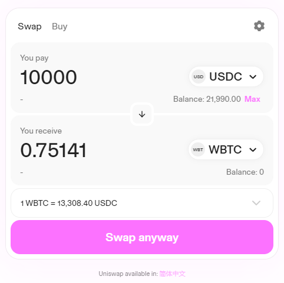

区块链是一个公共账本，普通人通常通过 Etherscan 等区块链浏览器查看详细的交易记录，但其实，它也可以成为普通人直接与合约交互的备选途径。

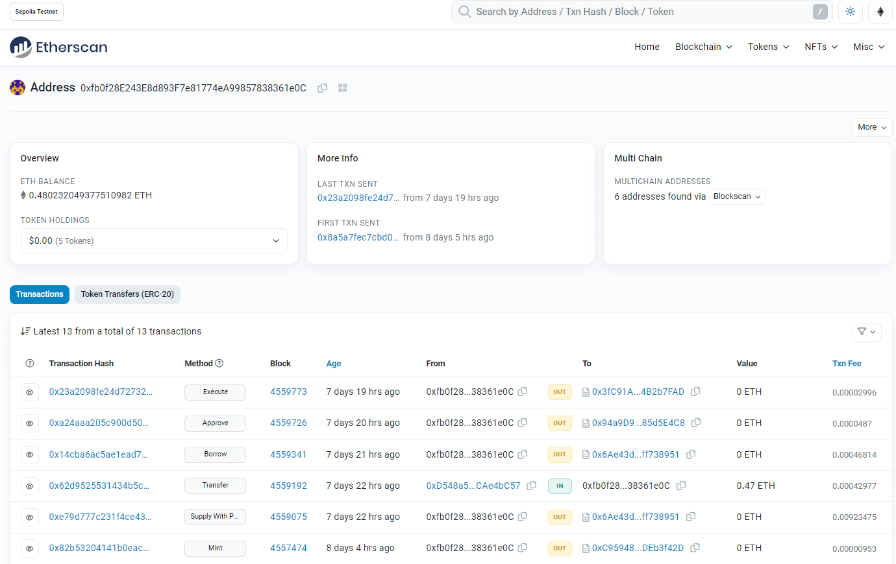

最常见的使用场景是在 NFT 发售的场景，NFT 首发时，很可能因为太火热导致网页宕机而无法 Mint，这时候如果用户能学会通过区块链浏览器直接与合约交互，就有机会抢先一步。

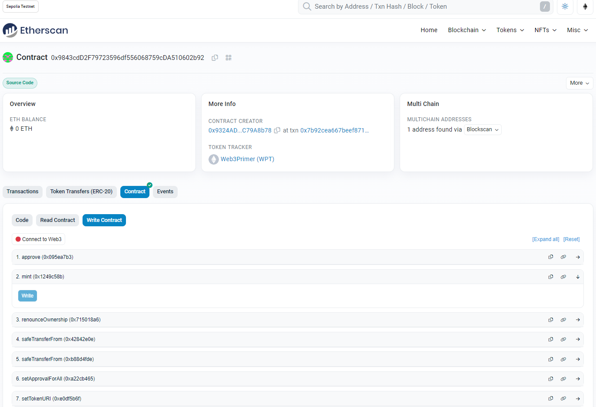

## 找到正确的合约地址

首先要确保我们交互的合约地址是正确的，一般可以通过一下三种途径：

1. 在官方网站、官方 Twitter 等媒体渠道找到正确的合约地址，这里一定要小心勿信了虚假信息。当然通过 Etherscan 交互也比直接点击网页链接，更容易防止钓鱼事件的发生。

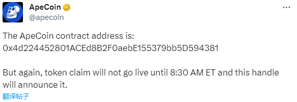

2. 通过 Etherscan 上他人的成功交易查询到正确的合约地址。

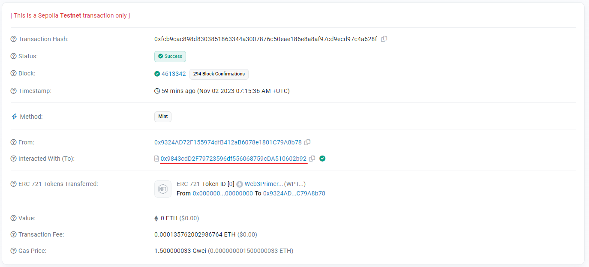

3. 通过 Opensea NFT 交易市场等官方渠道查询到正确的合约地址。

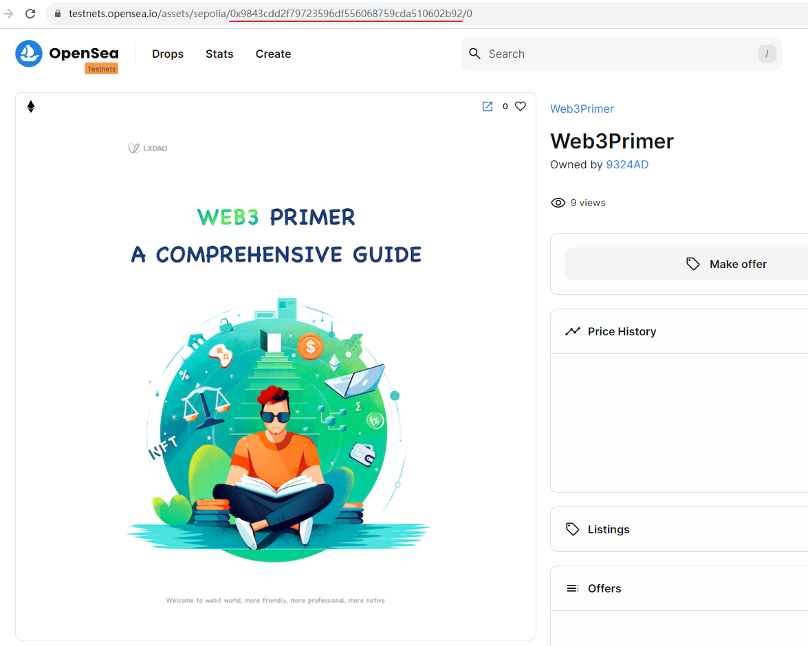

## Etherscan 上的合约交互

在 Etherscan 上搜索对应合约地址就可看到相关的交易记录，我们可以尝试在 [Sepolia 测试网的区块浏览器](https://sepolia.etherscan.io/)里搜索：0x9843cdd2f79723596df556068759cda510602b92

1. 搜索到之后，点击 Contract，进入合约相关界面

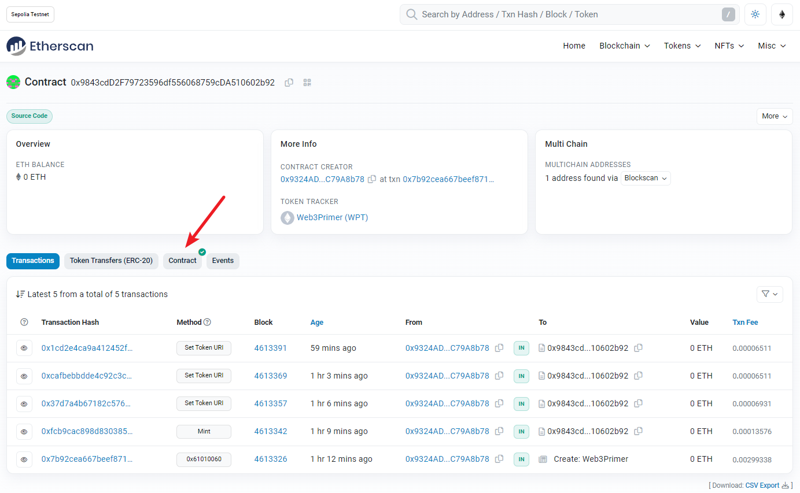

2. 点击 Write Contract 即进入写合约的界面
   
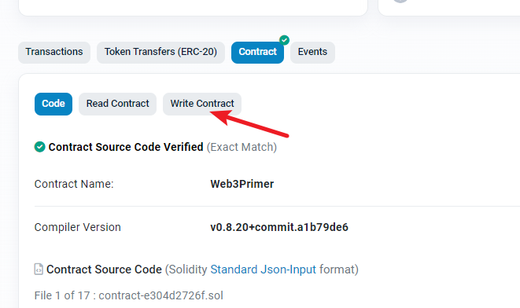

- Code：智能合约源代码
- Read Contract：读取合约数据
- Write Contract：向合约写入数据，即发起交互

3. 点击 Connect to Web3，连接钱包。并确定我们要调用的 Method。

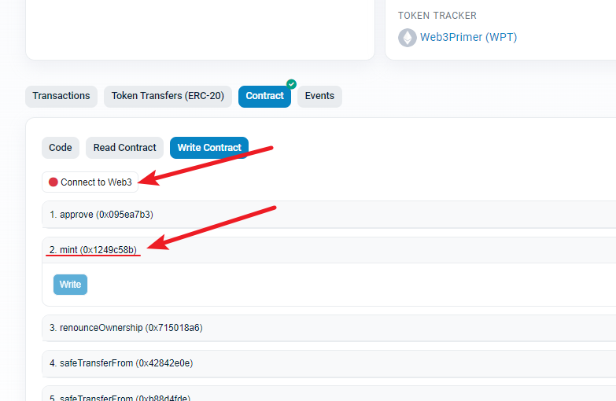

一般常用的 Method 为：
- Mint/FreeMint：不同合约名称不同，一般是初次铸造一些 NFT 或者代币。
- Approve/Approve For All：授权，一般授权 ERC20 代币的额度为 Approve；授权 NFT 则是 Approve For All，会将整个系列的 NFT 都同时授权。

4. 点击 Write，发起交易

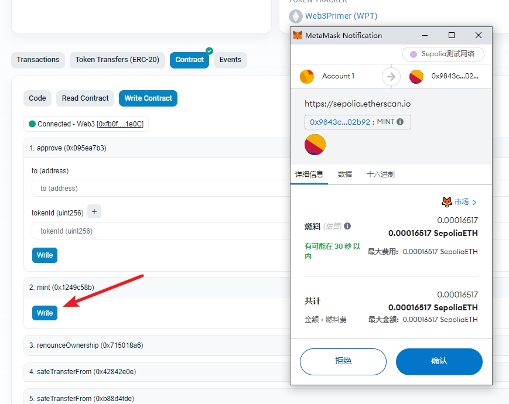

- 注意参数：一些 Method 需要输入参数，如 Approve 应该输入被授权者的地址和授权数量；Mint 可能需要参数，这种是可以直接交互进行铸造的，但也有部分合约 Mint 时要求一串 Signature，那该 NFT 就无法通过这种方式主要。

交易成功后，可以查询到我们 Mint 了一个编号为 1 的 NFT。

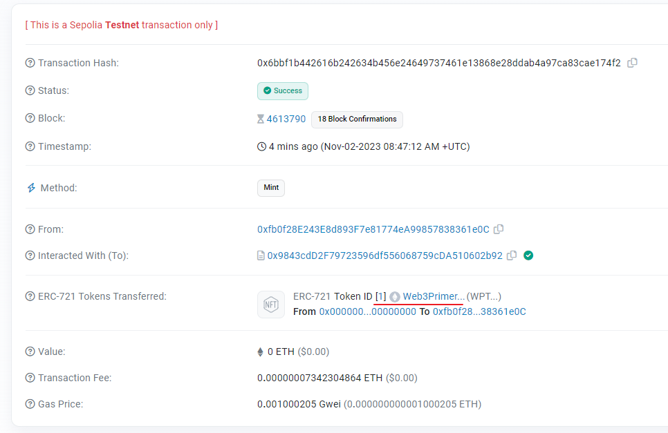

Mint 成功后，大家也可以在 [Opensea NFT 交易市场（测试网）](https://testnets.opensea.io/collection/web3primer-1)看到自己的这个 NFT 了。

最后，欢迎大家自由探索，尝试 Approve、Transfer 等更多的直接与合约交互的方式。

[点击此处 了解更多 Etherscan 与智能合约的知识](https://metatraining.buidlerdao.xyz/6-5-a6a27a7c965447b1bec19cedcbb24300)