# 探索其他链上活动

除了 DeFi 活动，最常见的链上活动就是买卖 NFT 了。交易 NFT 一般依托于 Opensea、Blur 等大型 NFT 交易市场进行，下面我们就来尝试一下测试网交易 NFT。

## 登陆 NFT 市场

这里我们用测试网的 Opensea 为例，首先进行登陆：

1. 打开 [testnets.opensea.i](https://testnets.opensea.io/zh-CN)，并点击右上角登陆，连接钱包。

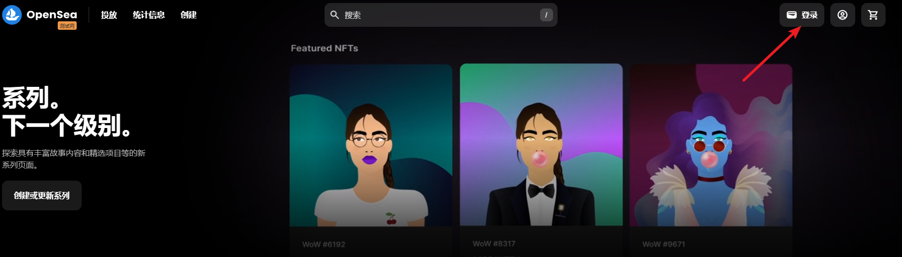

2. 登陆 Opensea需要进行一次签名，点击签名
   
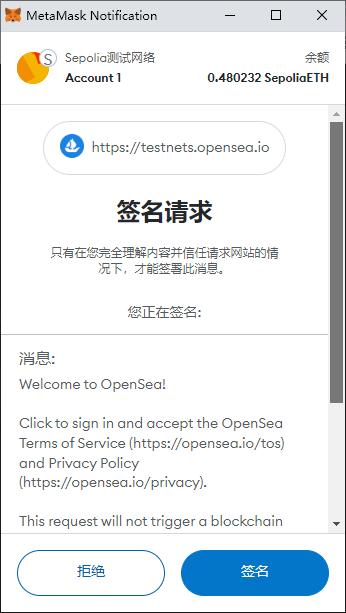

- 部分网站连接钱包时会要求签名一段文本，这是正常请求，但恶意网站也可能模仿这个环节放入恶意的签名或交易。为了安全我们应当检视一下签名内容，可以看到 Opensea 要求签名的内容是一段明文文本，没有可疑的特殊格式，也不需要发送交易上链，可以放心签名。

3. 点击个人头像，查看账户内的 NFT

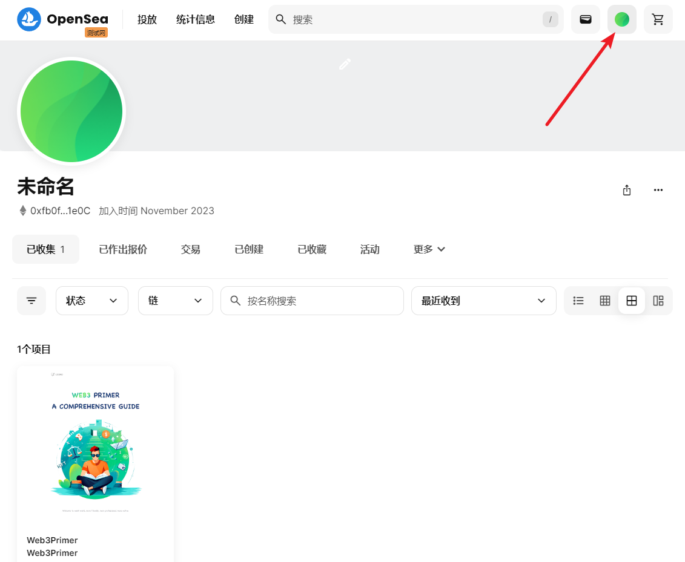

4. 可在上方搜索栏输入合约地址或名称来搜索特定的 NFT 系列

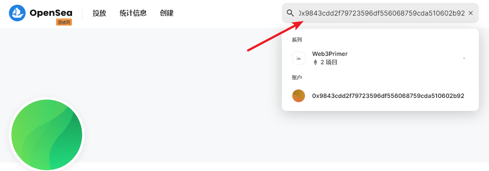

- 在 Sepolia 测试网上我们可以输入：0x9843cdd2f79723596df556068759cda510602b92

## 购买 NFT

搜索到 NFT 后，我们一般可以看到每张 NFT 的图像，和当前的标价、上一次交易的价格等信息，点击特定的 NFT，就可以进入详情界面进行交易。

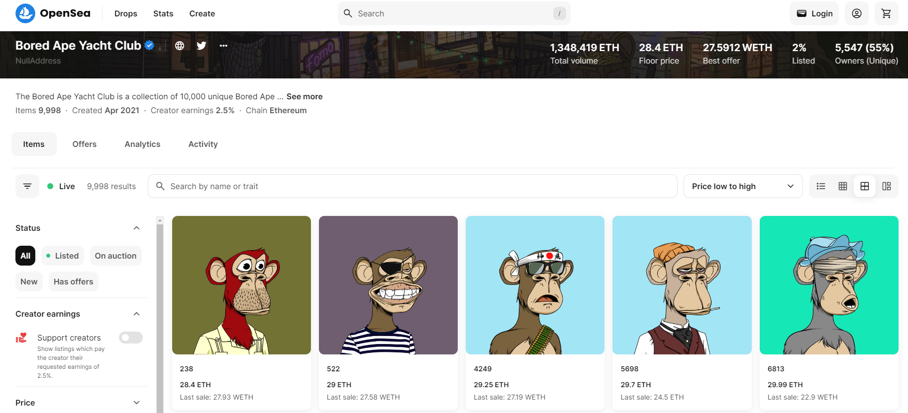

在测试网上我们以 [Web3Primer NFT](https://testnets.opensea.io/zh-CN/collection/web3primer-1) 为例尝试进行交易（为了简便我们采用了同样的图片，正常情况下每张 NFT 的图片都各不相同）。

1. 点击喜欢的 NFT，进入详情页

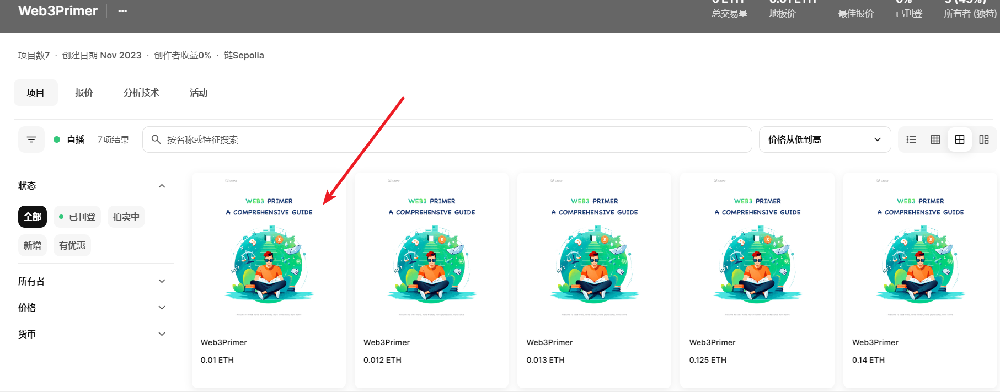

- 考虑图片风格、价格、稀有度等因素，稀有度可以在详情页中查看出现的几率，可以在第三方的 NFT 信息网站看到更详细的分析。

2. 点击立即购买（如果弹出安全提醒也勾选了解）

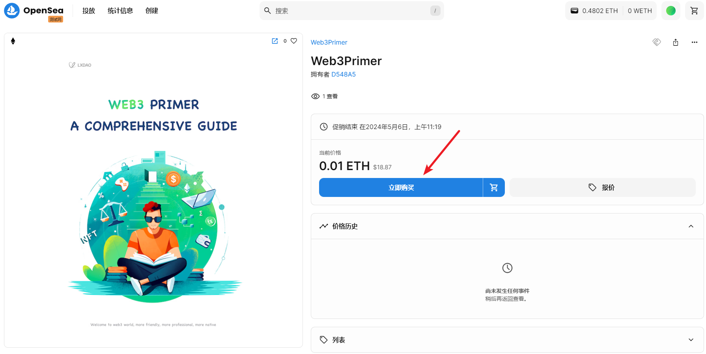
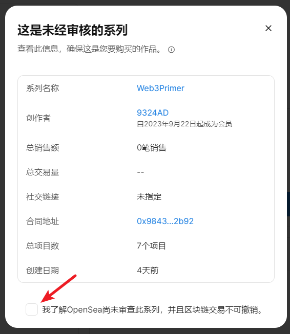

3. 发送交易上链

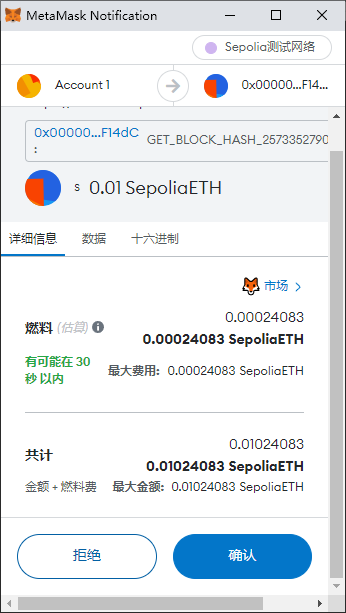

- 注意在抢购热门 NFT 时最好选择较高的交易手续费，否则可能出现购买失败的情况。

## 卖出 NFT

1. 在个人界面，鼠标移动至特定 NFT，点击下方出现的“待售清单”按钮（List for Sale）

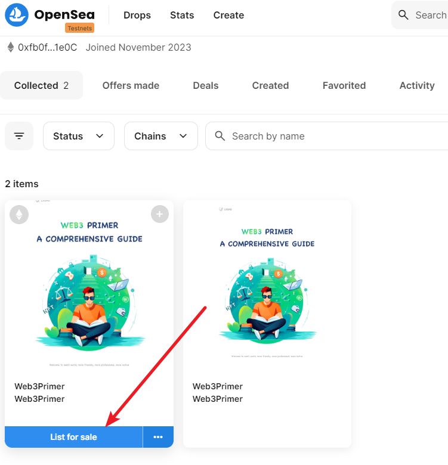

2. 设置好价格（一般以 ETH 计价）、时间，点击下方按钮上架

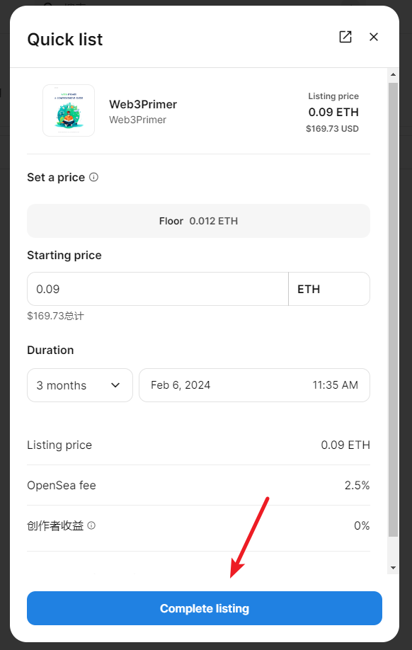

3. 初次出售需要授权，后续出售相同系列的 NFT 无需再次授权。

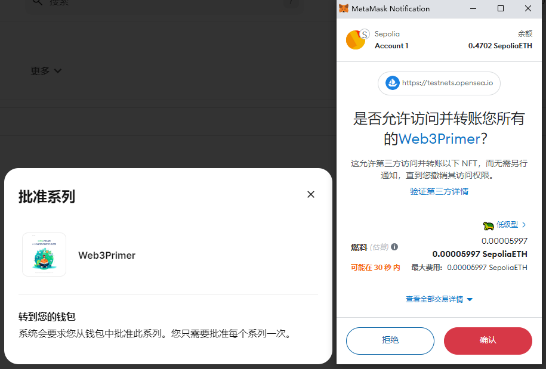

值得注意的是，NFT 授权是 SetApproveForAll，会将整个系列的 NFT 全部授权给某个合约，那么就出现了以下特点：
- 授权不是时间敏感型的，与抢购热门 NFT 不同，这里可以选择较低 Gas，在闲时成交。
- 由于 NFT 是将整个系列的图片都存储在一个合约之下，以编号区分，因此我们无法只授权单个 NFT，会将账户内该系列的 NFT 全部授权，因此要格外谨慎
- 新型钓鱼网站可能针对已授权的 NFT 进行恶意签名攻击，比如我们已将某系列的 NFT 授权给 Opensea，则黑客可能诱导你签名一段文本，实际上是允许黑客以超低价购买你的 NFT。

4. 签名一段特殊格式的明文文本，完成上架

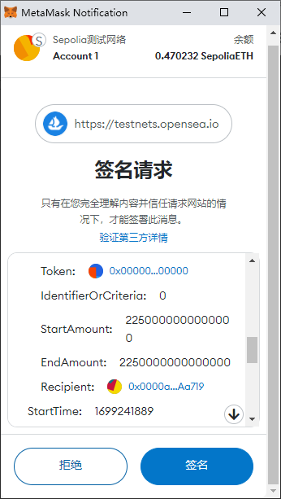

## 报价

除了基础的买卖 NFT 功能之外，我们也希望对一个 NFT 报价，以便用更低的价格买到 NFT。

1. 点击右上角 WETH 按钮，将 ETH 转为 WETH

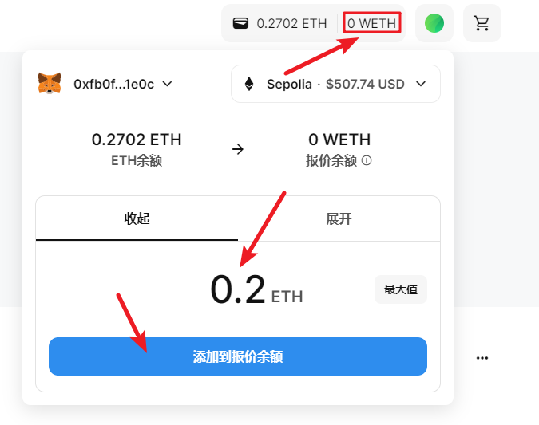

- WETH 是 Wrapped ETH，即打包过的 ETH，ETH 和 WETH 可以 1:1 进行转换。
- ETH 是以太坊的原生代币，比起常见的 ERC-20 代币有很多特殊的特点，比如只能自己发起交易无法被合约直接调用。变为 WETH 后，兼容 ERC-20 的各种标准，不过不可以作为 Gas 使用。

2. 可以在 NFT 系列界面对整个系列进行报价

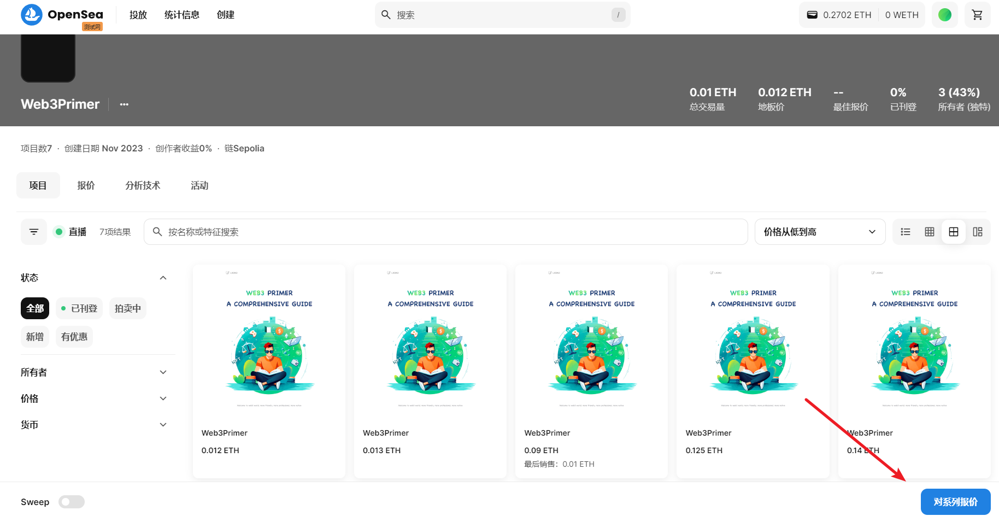
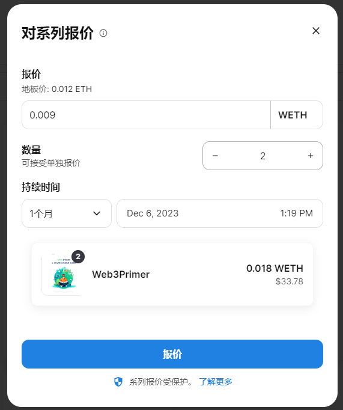

- 初次使用需要授权 Opensea 使用 WETH 的额度。

3. 可以在单个 NFT 页面进行报价

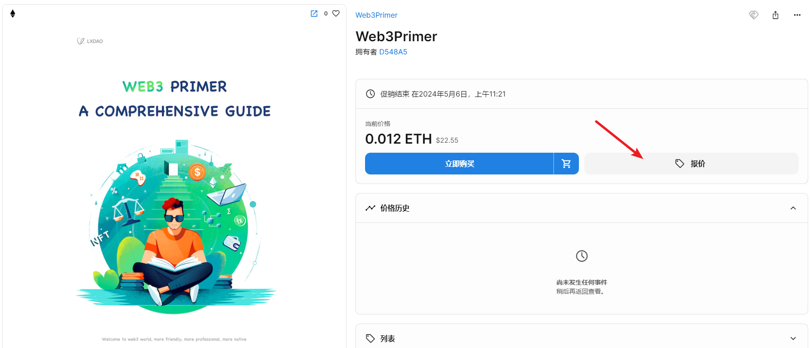
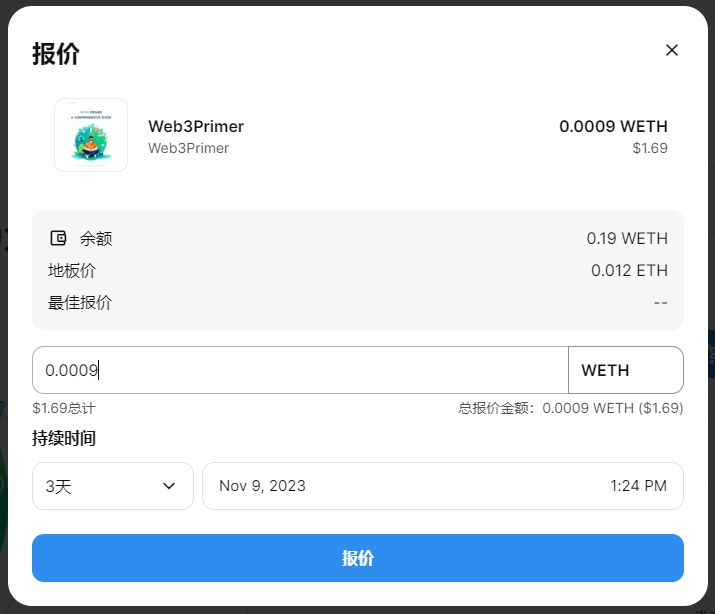

后续欢迎大家自由探索，尝试关于 NFT 市场的其他操作，如批量购买 NFT 、通过 Opensea 个人界面转移 NFT 等等。

[点击此处 了解更多 NFT 交易的相关知识](https://metatraining.buidlerdao.xyz/5-2-Opensea-c01ab66dfe84493daddfc204f7ea8b99)
