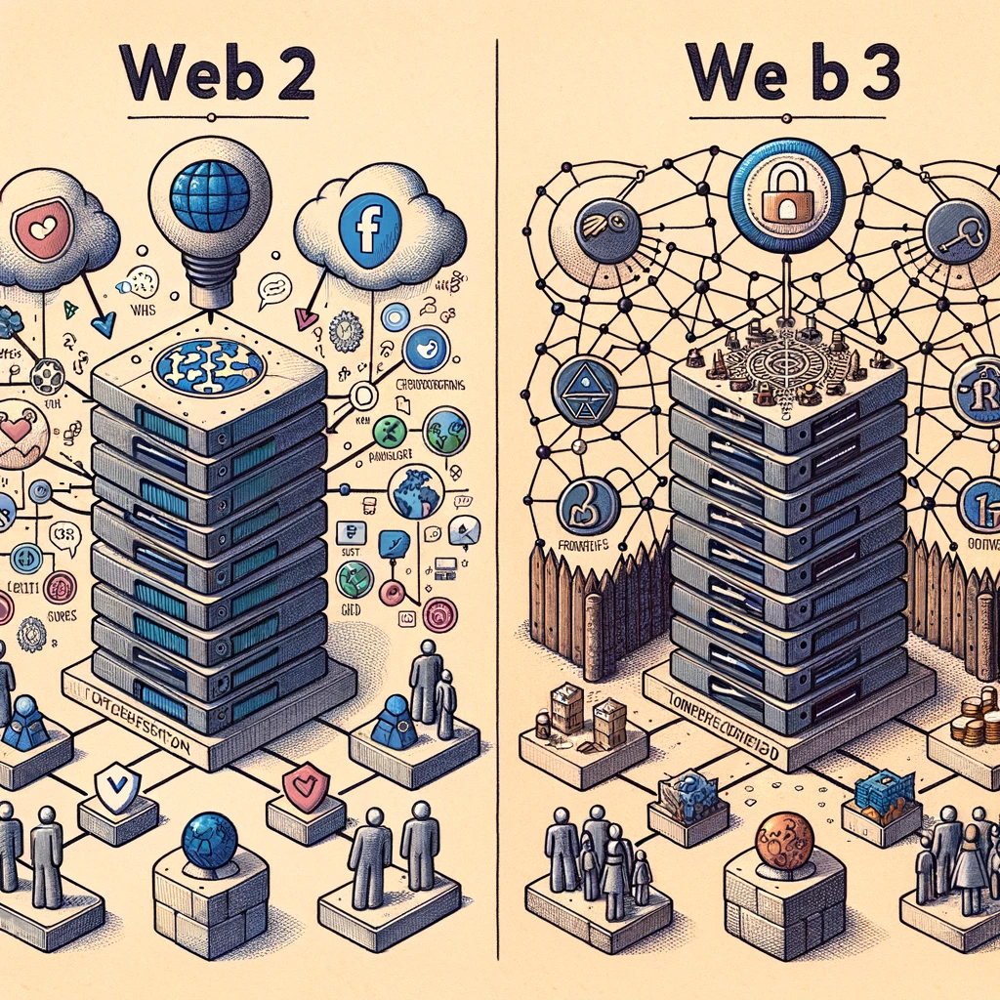
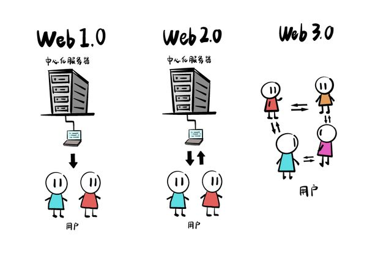
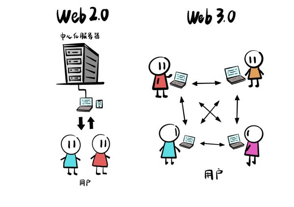
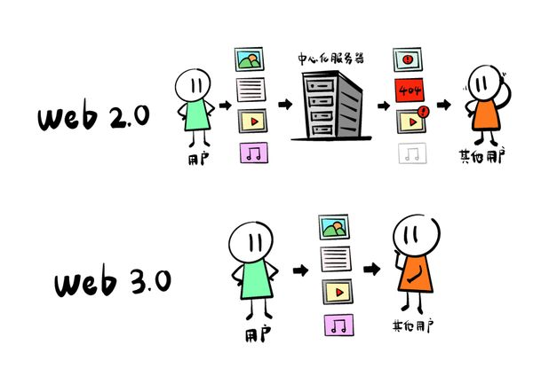
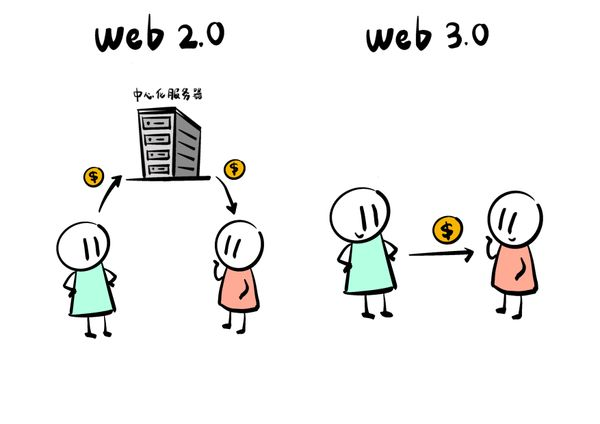
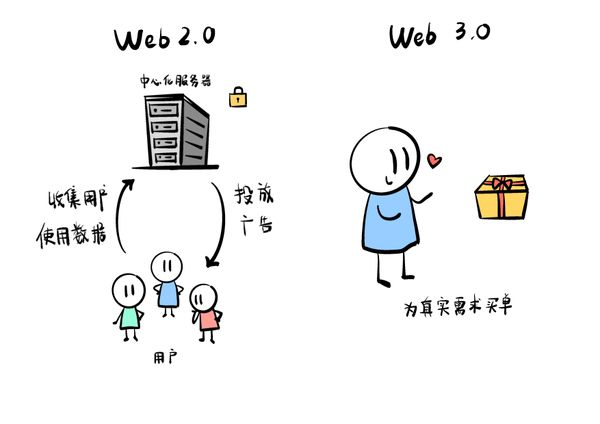

## 互联网的三次变革:从 Web 1.0 到 Web 3.0 - 从只读到只有想象力的限制

互联网从诞生以来,已经经历了三次重大的变革,每一次变革都对人类社会产生了深远的影响。

第一段:Web 1.0时代(数据只读时代)

特征是网站只提供静态信息,用户只能读取内容而难以交互。
网站主要以文字和图片为主,用户被动浏览内容,信息只能单向传播。内容由网站管理员发布和控制,用户无法参与其中。这就像一本静态的电子书,互联网被视为知识和信息的新来源。

第二段:Web 2.0时代(数据读写时代)

互联网成为一个交互平台,出现了博客、社交媒体等基于用户生成内容的网站。
文字、图片、音频、视频等多媒体内容激增,互联网成为一个活跃的交互平台。用户可以自由发布内容,评论、转发,网络世界被看成是一个大社区。但是,这些社交平台中心化地控制着我们的数据和关系。

第三段:Web 3.0时代(数据去中心化时代)

基于区块链、元宇宙等新技术,互联网变得更加开放和连接。
用户将真正拥有数据所有权,不再依赖中心化平台,互联网协作和价值创造将更加分散。
这是互联网理想主义初心的部分重现,网络的发展方向将人性化。Web2和Web3之间的主要差异如下。

#### 1. 中心化与去中心化
**Web2:** Web2.0是目前我们主要使用的互联网模型，它的特点是中心化。这意味着大部分的数据和权力都集中在少数几家大公司手中，例如Facebook、Google和Amazon。用户在这些平台上生成内容，而平台则负责存储这些内容并从中获利。

**Web3:** Web3.0则主张去中心化。在这种模型下，数据不再被存储在中心服务器上，而是被分散在全球范围内的多个节点中。这大大增强了数据的安全性，因为没有单一的失败点[1] 。

#### 2. 数据所有权
**Web2:** 在Web2.0时代，用户虽然可以生成内容，但实际上并不真正拥有这些内容。社交媒体平台可以随时更改其使用条款，甚至删除用户的内容。

**Web3:** Web3.0赋予用户真正的数据所有权。这意味着用户可以控制他们的数据如何被使用，而不是将这一权力交给第三方。

#### 3. 交互方式
**Web2:** Web2.0的交互主要是基于用户生成的内容，例如博客、社交媒体和评论。

**Web3:** Web3.0引入了智能合约的概念，允许用户与程序直接交互，而无需中间人。这开辟了无数的创新可能性，例如去中心化金融和去中心化应用。

#### 4. 安全性与透明性
**Web2:** 虽然Web2.0提供了更好的交互体验，但它也带来了许多安全隐患。中心化的数据存储使得这些平台成为了黑客的主要目标。

**Web3:** 由于其去中心化的特性，Web3.0提供了更高的安全性和透明性。每次数据更改都需要网络中的多数节点同意，这大大减少了恶意攻击的可能性。

#### 5. 商业模型
**Web2:** Web2.0的商业模型主要是基于广告的。平台提供免费的服务，但会收集用户的数据以投放针对性的广告。

**Web3:** Web3.0的商业模型则更加多样化，包括加密货币、代币化和微支付。用户可以直接为他们使用的服务支付，而不是以他们的数据为代价。

总的来说，每一次变革都推动互联网成为一个更加开放、互动、充满想象力的空间。而Web 3.0时代,互联网的发展可能只受限于人类的想象力,真正实现点对点价值自由传输。

Web3.0代表了互联网的下一阶段，它将带来更多的创新、更高的安全性和更大的自由度。但与此同时，它也带来了新的挑战，例如技术的复杂性和新的监管问题。但无论如何，Web3.0都标志着我们进入了一个新的、令人兴奋的数字时代。

## 🌐 Sources
1. [ethereum.org - Web2 与Web3 的对比](https://ethereum.org/zh/developers/docs/web2-vs-web3/)
