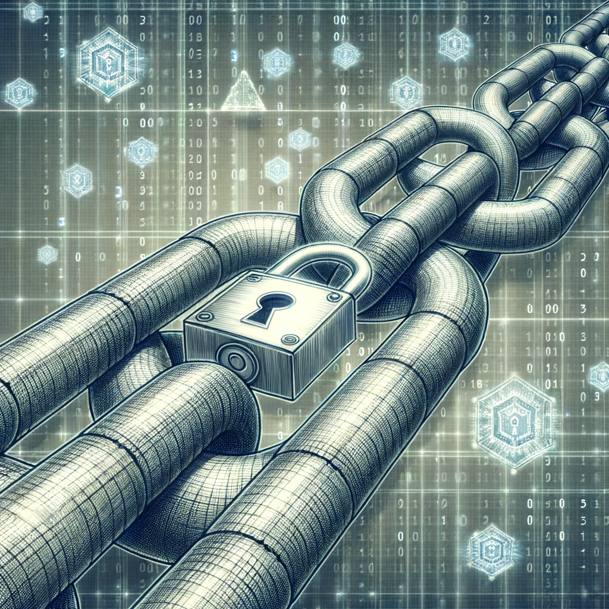

# 区块链中的密码技术：构建安全的数字桥梁

区块链，这个数字时代的革命性技术，为我们提供了一个去中心化、透明且不可篡改的数据存储和交易平台。但是，你是否曾经思考过，是什么使区块链如此安全和可靠？答案就是密码技术。让我们深入探索区块链中所使用的各种密码技术。

## **1. 什么是密码学？**
密码学是在对手存在的情况下进行安全通信的技术的实践和研究。它涉及将信息转化为代码，以防止未经授权的访问。

## **2. 区块链中的密码学技术——哈希函数**

哈希函数是区块链安全性的基石。它可以将任意长度的输入数据转化为固定长度的输出值。在区块链中，最常用的哈希函数是SHA-256。

- **作用：** 确保数据的完整性。如果交易数据发生了微小的变化，哈希值也会发生巨大的变化。
- **应用：** 每个区块的哈希值都是基于前一个区块的哈希值和当前区块的交易数据计算得出的，从而形成一个连续的链条。

## **3. 区块链中的密码学技术——公钥和私钥**

公钥和私钥是一对密钥，用于加密和解密信息。

- **公钥：** 用于加密信息。公钥是公开的，任何人都可以使用公钥加密信息。
- **私钥：** 用于解密信息。私钥是私有的，只有密钥的持有者才能解密用公钥加密的信息。
- **应用：** 在区块链中，私钥用于签署交易，而公钥用于验证交易的真实性。

## **4. 区块链中的密码学技术——数字签名**

数字签名是一种确保交易真实性和完整性的技术。

- **作用：** 通过使用私钥对交易信息进行签名，可以确保交易没有被篡改，并证明交易确实来自所声称的发送者。
- **应用：** 在区块链中，发送者使用私钥对交易进行签名，而接收者或其他节点使用发送者的公钥验证签名的真实性。

## **5. 区块链中的密码学技术——零知识证明**

零知识证明是一种允许验证者证明自己知道某个值，而无需揭示该值的密码技术。

- **作用：** 保护用户的隐私。在某些区块链应用中，如隐私币，零知识证明用于证明交易的有效性，而无需揭示交易的具体细节。
- **应用：** Zcash是一个使用零知识证明技术的加密货币。

## **6. 区块链中的密码学技术——多重签名（Multisig）**

多重签名是一种需要多个私钥才能签署交易的技术。

- **作用：** 增加安全性。例如，一个需要三个签名的交易可能需要三个不同的人批准。
- **应用：** 在区块链中，多重签名常用于创建安全的钱包和执行复杂的交易。

## **7. 结论**

密码技术为区块链提供了坚如磐石的安全基础，确保了数据的完整性、交易的真实性和用户的隐私。随着技术的发展，我们可以期待更多的创新密码技术被应用于区块链，为我们提供更加安全和可靠的数字世界。
