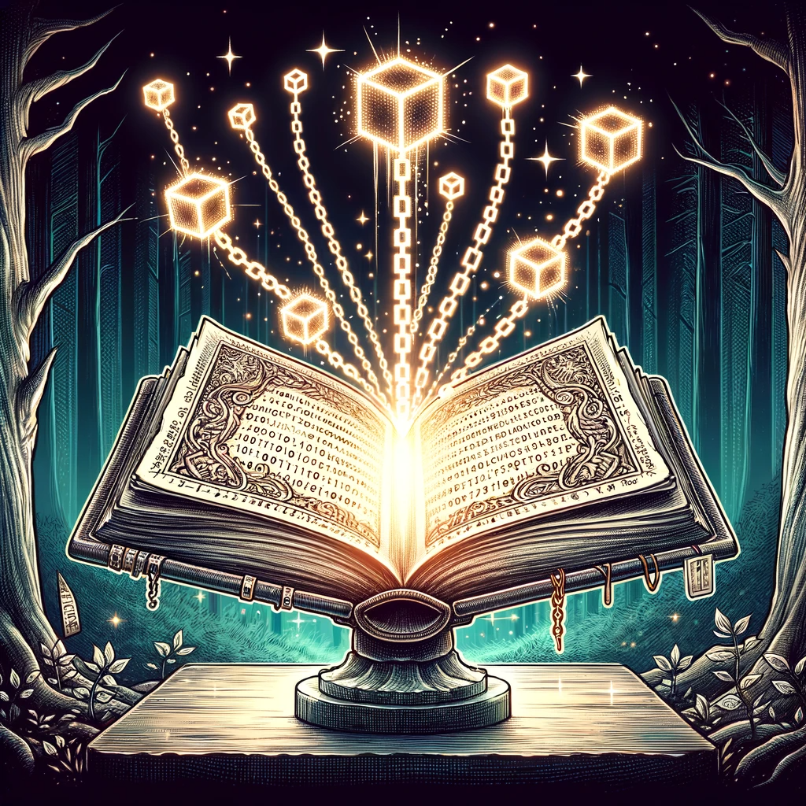

# 区块链原理：数字时代的魔法书

嗨，未来的数字巫师们！你是否曾听说过“区块链”这个词，然后想：“这是什么新鲜玩意儿？”好消息！今天，我们将一起探索这个神奇的数字魔法书的奥秘。拿起你的魔杖（或者鼠标），我们开始吧！

## 1. 区块链：是什么？

区块链，顾名思义，是由一系列“区块”组成的“链”。每个区块都包含一组交易记录，这些记录是加密的，确保其安全性。当一个区块被填满时，就会创建一个新的区块，并将其链接到前一个区块，形成一个连续的链条。

## 2. 为什么叫“去中心化”？

传统的数据库，如银行或社交媒体平台，都是“中心化”的，这意味着所有数据都存储在一个中心位置。而区块链则是“去中心化”的，数据分散在整个网络中，每个参与者都有一份完整的数据副本。这确保了数据的安全性和透明性。

## 3. 如何工作？

每当有人发起一个交易（例如，发送比特币给朋友），这个交易就会被发送到网络中。网络中的计算机（称为“节点”）会验证这个交易，确保它是有效的。一旦验证通过，这个交易就会被添加到一个区块中。当这个区块被填满，它就会被添加到链上，成为永久的记录。

## 4. 什么是“共识机制”？

为了确保所有节点都同意链上的交易记录，区块链使用了一种称为“共识机制”的方法。最常见的共识机制是“工作证明”（Proof of Work），它要求节点解决复杂的数学问题，以验证交易。这确保了区块链的安全性和完整性。

## 5. 区块链的优势

- **透明性**：所有交易都是公开的，任何人都可以查看。
- **安全性**：交易一旦被添加到链上，就不能被修改或删除。
- **去中心化**：没有中心权威，每个参与者都有平等的权利。
- **不可篡改**：一旦数据被添加到区块链，就不能被更改。

## 6. 区块链的应用

除了加密货币，区块链还有许多其他应用，包括：

- **供应链管理**：确保产品从生产到消费者手中的每一步都是透明的。
- **医疗记录**：创建一个安全、不可篡改的医疗记录系统。
- **投票系统**：创建一个透明、安全的在线投票平台。
- **数字身份**：为用户提供一个安全、去中心化的身份验证方法。

## 7. 区块链的未来

区块链技术仍然处于起步阶段，但其潜力是巨大的。随着技术的发展，我们可以期待更多的创新和应用，从金融到医疗，从娱乐到教育，区块链都将发挥重要作用。

总之，区块链是数字时代的魔法书，充满了无尽的可能性。希望这篇文章能帮助你更深入地了解区块链的原理和应用。现在，你已经准备好成为一个真正的数字巫师了！
