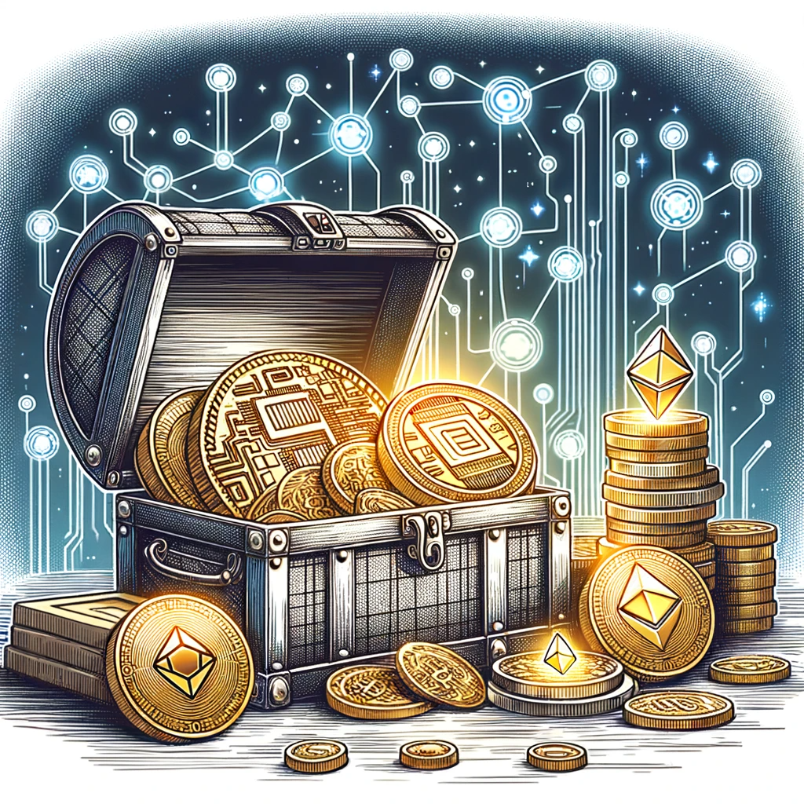

# 什么是数字资产：未来的黄金还是数字的泡沫？

你是否曾经听说过“数字资产”这个词，然后想：“这是什么新鲜玩意儿？”或者“听起来很高大上。在这里，我们将以最简单、最风趣的方式为你解开数字资产的神秘面纱。

## 1. 数字资产：是什么？

首先，让我们来定义一下“数字资产”。简单来说，数字资产是一种存在于数字形式的资产。听起来很简单，对吧？但等等，这还不是全部。数字资产可以是你的电子邮件、照片、音乐、电子书，甚至是那些神秘的加密货币，如比特币和以太坊。所以，如果你有一个电子钱包里有一些比特币，恭喜你，你现在是一个数字资产的拥有者！🎉

## 2. 为什么数字资产如此受欢迎？

在过去的几年里，数字资产的价值飙升，吸引了大量的投资者和媒体关注。但为什么呢？原因有很多：

- **稀缺性**：与传统的货币不同，许多数字资产（如比特币）的数量是有限的。这意味着，随着时间的推移，它们可能会变得越来越稀缺，从而增加其价值。
- **去中心化**：数字资产不受任何中央机构或政府的控制。这意味着，没有人可以随意增加货币供应或决定它的价值。
- **安全性**：通过使用先进的加密技术，数字资产提供了一种安全、透明和不可篡改的交易方式。

## 3. 数字资产的种类

数字资产的世界是多姿多彩的，有各种各样的资产供你选择：

- **加密货币**：如比特币、以太坊和瑞波币。它们是基于区块链技术的数字货币，可以用来购买商品和服务，或作为一种投资。
- **非同质化代币 (NFTs)**：这是一种独特的数字资产，代表了某种独特的东西，如艺术品、音乐或虚拟土地。
- **数字证券**：这是传统的金融资产（如股票和债券）的数字版本。
- **其他**：还有许多其他类型的数字资产，如数字收藏品、虚拟商品和数字身份。

## 4. 数字资产的风险

正如任何投资一样，数字资产也有其风险。价格波动、技术问题、法规变化和安全问题都可能影响你的投资。所以，在决定投资之前，一定要做足够的研究，并咨询专家的意见。

## 5. 怎样开始？

对于初学者来说，进入数字资产的世界可能会感到有点吓人。但不用担心，只需遵循以下几个简单的步骤，你就可以开始你的数字资产之旅：

1. **研究**：首先，花一些时间了解不同的数字资产和它们的工作原理。
2. **选择一个钱包**：你需要一个地方存储你的数字资产。有许多不同类型的钱包可供选择，包括硬件钱包、软件钱包和在线钱包。
3. **购买数字资产**：一旦你选择了一个钱包，你就可以开始购买数字资产了。有许多不同的交易所和
