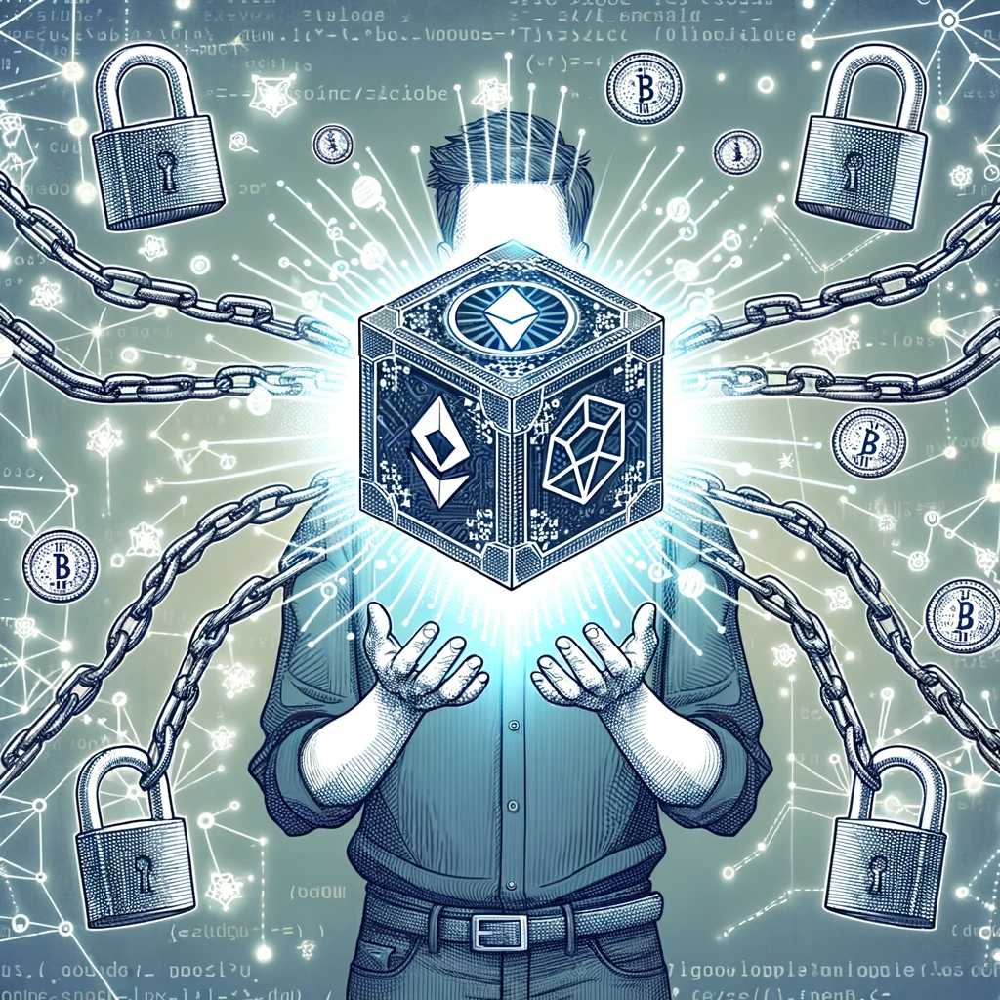

# 区块链钱包：你的数字黄金的宝箱

嗨，亲爱的探险家们！你是否曾经想过，当你在数字世界中挖掘黄金（也就是加密货币）时，你应该将它存放在哪里？好消息！你不再需要一个巨大的金库或一个藏在床下的保险箱。欢迎来到区块链钱包的神奇世界——你的数字黄金的完美宝箱！

## 1. 区块链钱包：是什么？

区块链钱包不是一个真正的“钱包”。你不能把它放在口袋里或用它买咖啡。它是一个数字工具，允许你存储、发送和接收加密货币。想象一下，它就像是一个魔法的宝箱，只有你有钥匙可以打开它！

## 2. 钱包的种类

- **软件钱包**：这是一个在线、桌面或移动应用程序。它们是最常用的钱包类型，因为它们易于使用并提供了良好的用户界面。但是，因为它们是互联网连接的，所以它们可能更容易受到攻击。
- **硬件钱包**：这是一个物理设备，类似于一个USB驱动器。它们被认为是最安全的钱包类型，因为它们不是常年在线的。
- **纸钱包**：是的，你没有听错！这是一个物理纸张，上面印有你的私钥和公钥。只要不失去或弄湿它，它就是一个非常安全的存储方法。

## 3. 私钥 vs. 公钥

- **私钥**：这是你的钱包的“密码”。它是一个秘密的数字组合，只有你知道。失去它就意味着失去了访问你钱包中资金的能力，所以务必小心保管！
- **公钥**：你可以把它看作是你的“邮箱地址”。当别人想给你发送加密货币时，他们会发送到你的公钥地址。

## 4. 如何选择钱包？

选择钱包时，你应该考虑以下几点：

- **安全性**：确保选择的钱包有良好的安全记录和强大的安全功能。
- **易用性**：如果你是初学者，你可能想要一个有友好用户界面的钱包。
- **兼容性**：确保钱包支持你想要存储的加密货币。

## 5. 注意事项

- **备份你的钱包**：确保经常备份你的钱包，以防万一。
- **不要与他人分享你的私钥**：你的私钥就像是你的银行密码，不要与任何人分享。
- **小心钓鱼攻击**：总是从官方来源下载钱包应用程序，避免点击可疑的链接。

## 6. 总结

区块链钱包是存储和管理你的数字资产的关键工具。选择一个适合你的钱包，小心谨慎地使用它，你的数字黄金将会安全无虞！

---

好了，这就是关于区块链钱包的简单介绍。希望你喜欢这篇文章，并从中学到了一些新知识。在数字世界中，安全总是第一位的，所以请始终保持警惕，保护好你的宝贵资产。
