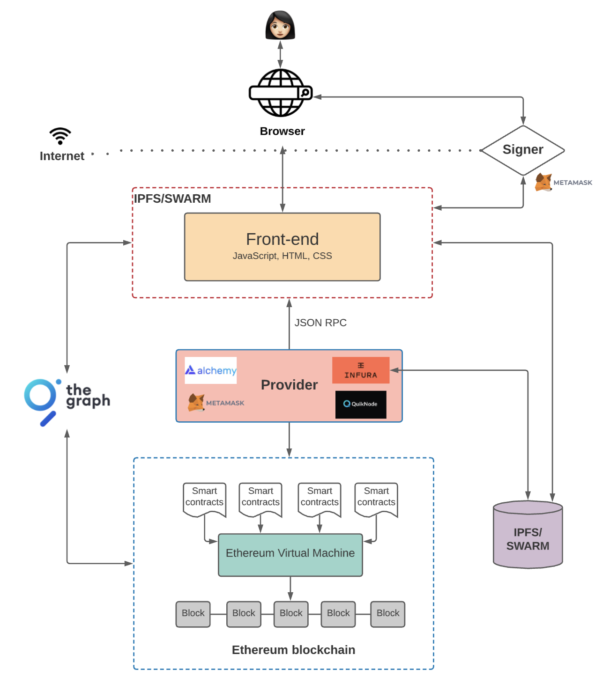
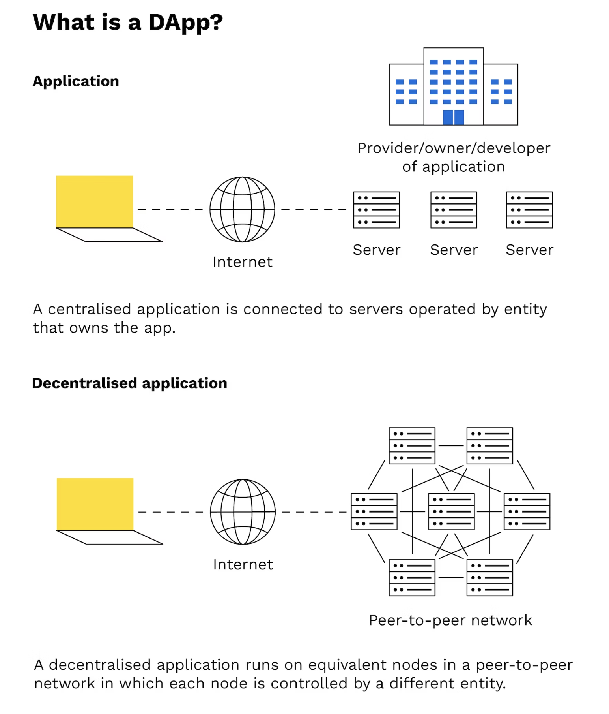

# 什么是DApp
DApp的全称是 Decentralized App, 中文翻译为去中心化应用。它的代码运行在一个去中心化 P2P 网络上运行。DApp 可以应用于各种不同的领域，包括金融服务、供应链管理、社交媒体、游戏、投票系统等。它们的发展潜力在于创新和改变传统行业的方式，使用户能够更加自主地管理他们的数字资产和数据。但需要注意的是，DApp 的发展还面临一些挑战，如性能问题、用户体验、法律法规等，这些问题需要在未来得到解决。它的架构图如下：

***
# DApp的上下游技术
* 区块链平台： 以太坊，ZkSync，Poloygn等
* 智能合约开发语言：Solidity，Move
* 去中心化存储：IPFS
* 加密钱包：MetaMask，Sui Wallet，ArgentX等

# DApp 与 App有什么区别

DApp的全称是 Decentralized App, 中文翻译为去中心化应用。它的代码运行在一个去中心化 P2P 网络上运行。与此对应的是, 是我们日常生活中常见的中心化应用,比如微信,QQ,淘宝,京东等。它的代码运行在中心化服务器上。此外DApp可以用任何语言编写（就和编写一个App一样）。它有用户界面，能往服务器发送信息。而且它的前端还可以托管在去中心化存储上，例如IPFS。其中比特币是区块链历史中的第一个DApp应用。

***

# 使用DApp的优点

* 零停机时间 – 一旦将某 dapp 的智能合约部署到区块链上，整个网络都能为那些希望与合约互动的客户提供服务。 因此，恶意参与者无法针对单个 dapp 发起 DoS 攻击。

* 隐私 – 您不需要提供真实世界的身份来部署或与 dapp 进行交互。

* 抵制审查 – 网络上没有任何一个实体可以阻止用户提交交易、部署 dapp 或读取区块链上的数据。

* 数据完整性 – 由于采用了加密基元，存储在区块链上的数据是不可更改和无可争议的。 恶意行为者无法伪造已经公开的交易或其他数据。

* 无需信任的计算/可验证的行为 – 智能合约可以分析并保证以可预测的方式执行，而无需信任中心化组织。 这在传统模式下是不存在的，比如我们使用网上银行系统时，我们要相信金融机构不会滥用我们的金融数据，不会篡改记录，也不会被黑客攻击。

# 使用DApp的缺点

* 维护 – dapp 可能更难维护，因为发布到区块链的代码和数据更难修改。 在部署后，开发人员很难对去中心化应用程序（或其存储的底层数据）进行更新，即使在旧版本中发现了漏洞或安全风险。

* 性能开销 – 巨大的性能开销，而且难以扩展更多性能。 为了达到以太坊所追求的安全、完整、透明和可靠的水平，每个节点都会运行和存储每一笔交易。 除此之外，达成权益证明共识也需要时间。

* 网络拥塞 – 至少在当前模型中，如果一个 dapp 使用了太多的计算资源，整个网络都会承担影响。 目前，该网络每秒只能处理约 10-15 笔交易；如果交易发送的速度超过这个速度，未确认的交易池会迅速膨胀。

* 用户体验 – 设计用户友好的体验可能更难。普通终端用户可能会发现，很难以真正安全的方式设置与区块链互动所需的工具堆栈。

* 集中化 — 无论如何，建立在以太坊基础层之上的用户友好型和开发人员友好型解决方案最终看起来都像集中式服务。 例如，这种服务可以在服务器端存储密钥或其他敏感信息，使用中心化服务器为前端服务，或在写到区块链之前在中心化服务器上运行重要的业务逻辑。 这消除了区块链与传统模式相比的许多（并不是全部）优势。

总之一句话，凡是代码部署在区块链上的应用。我们都可以称它们是一个DApp.

