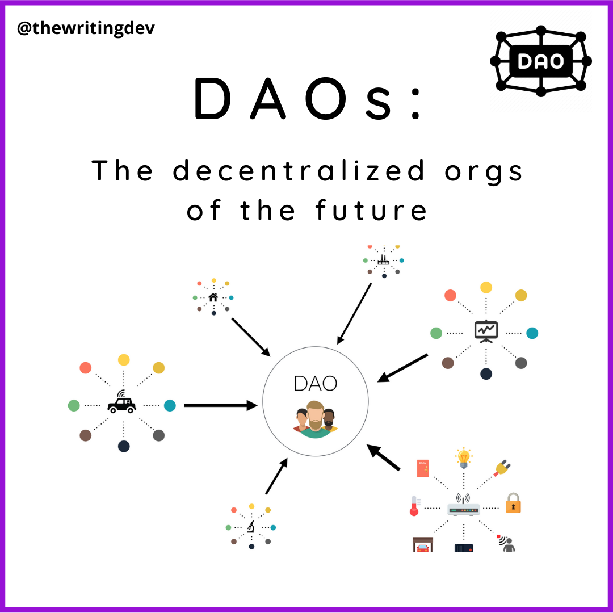

# 什么是DAO
DAO的全名是“decentralized autonomous organization”，中文是“去中心化的自治组织”。拿传统组织来举例，在一家公司中，策略的决定人主要是老板，大部分时候是一种一言堂的模式。DAO的主要目的是超越传统组织形式，以分布式、透明和信任最小化的方式来进行集体决策。简而言之，DAO是一种新型的组织架构。人们可以独立验证组织的运行方式，并基于这样的共识朝着共同的目标努力。并且DAO利用了区块链智能合约，将部分或全部流程写入合约代码中，以执行决策并分配所有权。智能合约的出现为创新奠定了基础，因为智能合约可以让DAO的治理规则完全透明化，而且无法被任何DAO成员或外部方篡改。

# DAO的优势
* 透明
DAO的规定写在智能合约中，活动都对社会公开。任何人都和审计。
* 民主
DAO中任何成员都可以提交提案、对别人的提案发起挑战或进行投票。
* 信任最小化
DAO的结构、共识机制以及落地执行机制都被写入了开源智能合约中，而智能合约被部署在了公链上，因此一旦达成共识，任何一方或小团体都无法篡改治理流程。

# DAO具体有什么工作

* 调整Dapp参数
* 提交提案并进行讨论
* 管理协议的资金
* 决定协议的长期路线图
* 制定协议的分成

# DAO生态概览

* [MakerDAO](https://makerdao.com/en/)是一个组织，负责管理去中心化的stablecoin DAI。DAO成员负责为协议制定参数，比如调整利率、添加/删除抵押资产以及核心部门团队入职/离职。
* [Gitcoin](https://www.gitcoin.co/)是一个DAO，用户在平台上可以通过二次方投票机制，共同为以太坊上的公用事业以及其他开源区块链项目募款。
