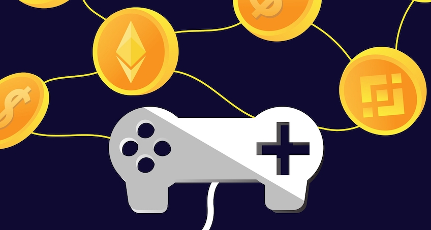

# 什么是GameFi
GameFi由Game（游戏）和Finance（金融）两个词组合而成，意指为玩家提供经济激励，可以边玩边赚的区块链游戏，也叫链游。在我们的日常生活中，这种模式也随处可见，比如每天背单词打卡一定时间获得红包奖励，电商APP种水果领红包等。只不过生活中的这种游戏是在链下的。

# 如何理解GameFi
我们试想一个场景，将大话西游这种传统游戏改造成链游。将其中的宠物，装备，装扮，道具制作成一个一个NFT。允许玩家自由交易。所有权属于玩家而不属于游戏厂商。厂商没有回收的权力。其次人物的属性以及数据与钱包绑定，厂商没有回收你帐号的权力。这样大话西游就被我们改造成链游。

# GameFi发展史
最早期的GameFi，其实是以EOS为底层协议的博彩游戏。然后由AXIE币安一手投资开创的双币模型，进而也诞生了像YGG一样的游戏公会。随着GameFi的继续发展，市场上逐步涌现出一批新的玩法，从Play to earn过渡到Run to earn、learn to earn等，并涌现出了一批优质项目，比如Stepn以及LMS（学习英语）等新的链游。

# GameFi生态概览

* [Axie Infinity](https://axieinfinity.com/)是一款数字宠物世界形式的去中心化游戏。 玩家通过虚拟货币购买三只小宠物（Axie），使用它们繁殖出新的宠物进行战斗，并且与其他玩家战斗赚取加密代币，或将自己多余的宠物卖给他人获取收益，此外玩家也可以在游戏中购买虚拟地产。

* [BigTime](https://bigtime.gg/)玩法类似于《暗黑破坏神》。与此前的现象级链游Axie Infinity相似，Big Time设立了打金机制，玩家刷副本、打怪可获得游戏代币BIGTIME
