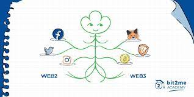

# 什么是Web3 Social
传统的社交产品有在国外流行的社交媒体Twitter,国内流行的新浪微博。他们是私人公司，其产品也是一个封闭的协议。个人用户的数据存储在这些公司的数据库中。其个人数据的所有权本质上是私人公司的而不是个人的。而Web3社交一些围绕开源的协议产生。就拿最近较火的Lens[1]举例。Lenster[2]是基于Lens协议的类似Facebook的应用程序。我在Lenster上总共有15位粉丝。这意味着Lenster上有15个很棒的人选择了在我的Lenster个人资料上点击“关注”，并铸造一个Follow NFT。现在假设我违反了Lenster的内容审核规则，它决定禁止我，类似于MetaMask或Uniswap从他们的前端过滤欺诈代币。如果这一禁令发生，我实际上不会失去我的15名忠实粉丝，原因很简单，我的社交图谱不存在于Lenster应用程序中，而是存在于Polygon不可更改的智能合约中的底层Lens协议数据库中。它们以NFT的形式存在，这使得它们可以完全互操作。
因此，当我跳转到Lens Protocol上的另一个应用程序，比如类似推特的应用程序Phaver时，我的社交影响力仍然完好无损。只要其他Lens应用程序通过镜像已铸造的Follow NFT的数量来解译其粉丝计数指标，它应该是一样的。内容也是如此，比如LensTube上的一段视频，LensTube[3]是Lens Protocol上一个类似YouTube的应用程序。如果LensTube将我的视频移除，只会造成小小的不便。该视频仍然存在于Lens Protocol的数据库中，因此可以在Lenster、Phaver或任何其他旨在提取视频数据的应用程序中观看。Lens应用程序只是前端应用程序，而不是dapp！

# Web3 Social 不足之处
* 内容质量问题
* 没有广大的使用者基础，人与人互动性较少

# 常见的Web3 Social应用程序

* [Friend.tech](https://www.friend.tech/)是构建在Base区块链上的去中心化社交应用，用户需要通过绑定推特和钱包来使用Friend.tech 并以此获利。 Friend.tech 的定位是将用户的影响力代币化，用户可以购买其他用户的“Key”（原名为Share）以获得和其他用户直接交流的权限。

* [Farcaster](https://www.farcaster.xyz/)是由Coinbase 前员工Dan Romero 和Varun Srinivasan 开发的Web3 社交网络。 它是一个用于构建去中心化社交网络的底层应用协议，支持开发者在协议上搭建各种应用程序，且用户能够在不同应用程序之间自由迁移社交资源及身份。

* [CyberConnect](https://link3.to/cyberconnect)是一种基于区块链技术的去中心化社交图谱协议。 旨在颠覆传统的Web2社交模式，从而解决用户数据及个人信息被社交平台垄断，以及不同平台无法互通数据和身份信息等问题。 简单来说，CyberConnect 通过构建一个去中心化的社交图谱，让用户的社交关系能够统一地集合在一个平台上。
