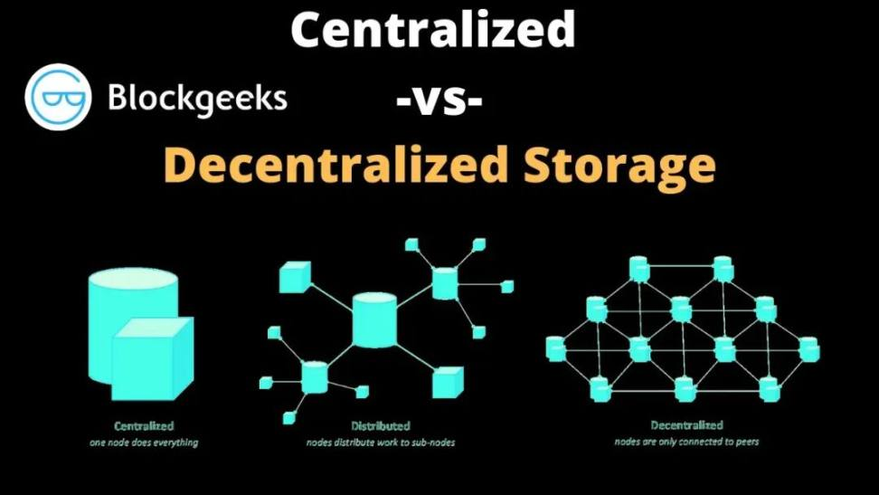
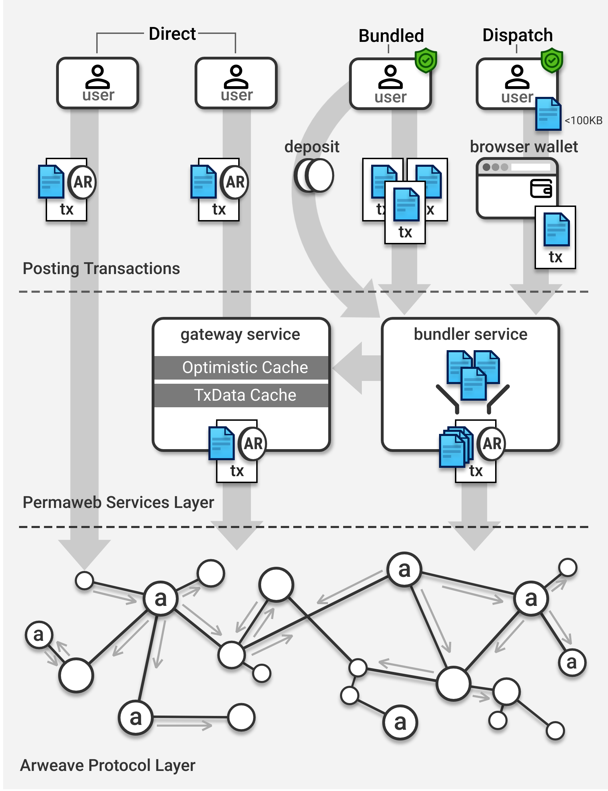

# 什么是去中心化存储
拿大家常用的百度网盘来举例，我们在日常生活中，将视频，照片，PPT等文件存入百度网盘，如果有一天百度破产倒闭。那我们的数据将会随着百度公司的破产倒闭而丢失。从这个方面来理解去中心存储的话。因为去中心化存储有好多节点，可能在全球各地都有节点，如果某一个节点发生意外宕机了。那么我们的数据依然还在，依然可以下载。除非有一天发生极端情况，所有节点都宕机了。

# 去中心化存储如何运作
去中心化存储系统通常建立在区块链技术或其他分布式账本技术（DLT）的基础之上，为数据存储提供了透明、安全和不可篡改的基础。在去中心化系统中存储数据时，首先会对数据进行加密，然后将其分割成小块或 "碎片"，最后将每个小块或 “碎片” 存储在网络中的多个存储节点上。

为确保数据的冗余性和可用性，每个小块或 “碎片” 通常会被复制多次，并存储在不同的节点上。当用户请求访问存储的数据时，系统会从网络中检索相关的小块或 “碎片”，然后进行重新组装，并为用户解密数据。这一过程依赖于复杂的算法、加密技术和共识机制，以确保数据的完整性、安全性和可用性。

# 去中心存储的优势
* 更高的安全性：去中心化存储系统利用先进的加密技术，将数据分布在多个节点上，大大增加了黑客访问或篡改数据的难度。相比之下，中心化存储系统更容易受到单点故障、网络攻击、数据泄露和系统故障的影响

* 抗审查性：去中心化存储系统本质上更具抗审查性和抵抗数据篡改的能力。由于数据分布在全球节点网络中，任何单一实体或机构都难以控制、操纵或审查存储的信息。

# 去中心化存储的缺点
* 可扩展性问题： 去中心化存储网络可能会面临可扩展性问题。随着数据和用户数量的增长，系统会变得更加复杂和资源密集，可能导致数据检索时间变长和整体网络效率下降。

* 数据检索速度较慢： 与中心化系统相比，去中心化存储系统的数据检索速度通常较慢，因为需要从整个网络的多个节点检索和重新组装数据。对于需要快速访问存储数据的用户来说，这可能会构成问题，特别是在时间要求严格的情况下。

# 常见的去中心化存储协议
* [IPFS](https://ipfs.tech/)
IPFS，星际文件系统是一种用于存储和访问文件、网站、应用程序和数据的分布式系统。

* Arweave
Arweave 与 IPFS 相比最大的特色是一次性付费、永久保存数据。

