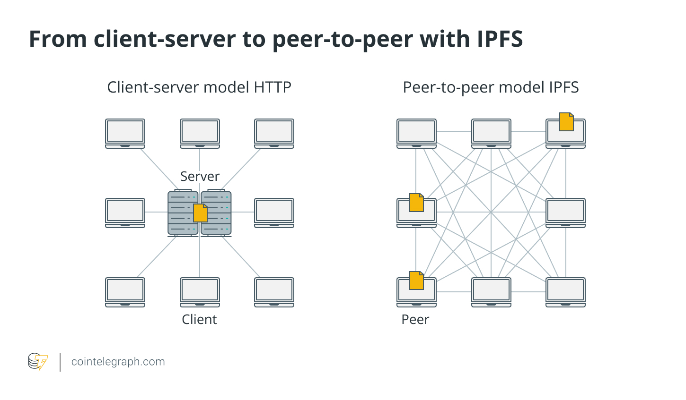

# 什么是去中心化存储
拿大家常用的百度网盘来举例，我们在日常生活中，将视频，照片，PPT等文件存入百度网盘，如果有一天百度破产倒闭。那我们的数据将会随着百度公司的破产倒闭而丢失。从这个方面来理解去中心存储的话。因为去中心化存储有好多节点，可能在全球各地都有节点，如果某一个节点发生意外宕机了。那么我们的数据依然还在，依然可以下载。除非有一天发生极端情况，所有节点都宕机了。

# 常见的去中心化存储协议
* [IPFS](https://ipfs.tech/)
IPFS，星际文件系统是一种用于存储和访问文件、网站、应用程序和数据的分布式系统。

* Arweave
Arweave 与 IPFS 相比最大的特色是一次性付费、永久保存数据。
/todo 加一个Arweave的介绍图

# 去中心存储的优势
* 更高的安全性：去中心化存储系统利用先进的加密技术，将数据分布在多个节点上，大大增加了黑客访问或篡改数据的难度。相比之下，中心化存储系统更容易受到单点故障、网络攻击、数据泄露和系统故障的影响
* 抗审查性：去中心化存储系统本质上更具抗审查性和抵抗数据篡改的能力。由于数据分布在全球节点网络中，任何单一实体或机构都难以控制、操纵或审查存储的信息。
